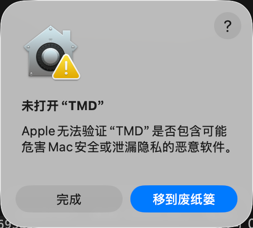
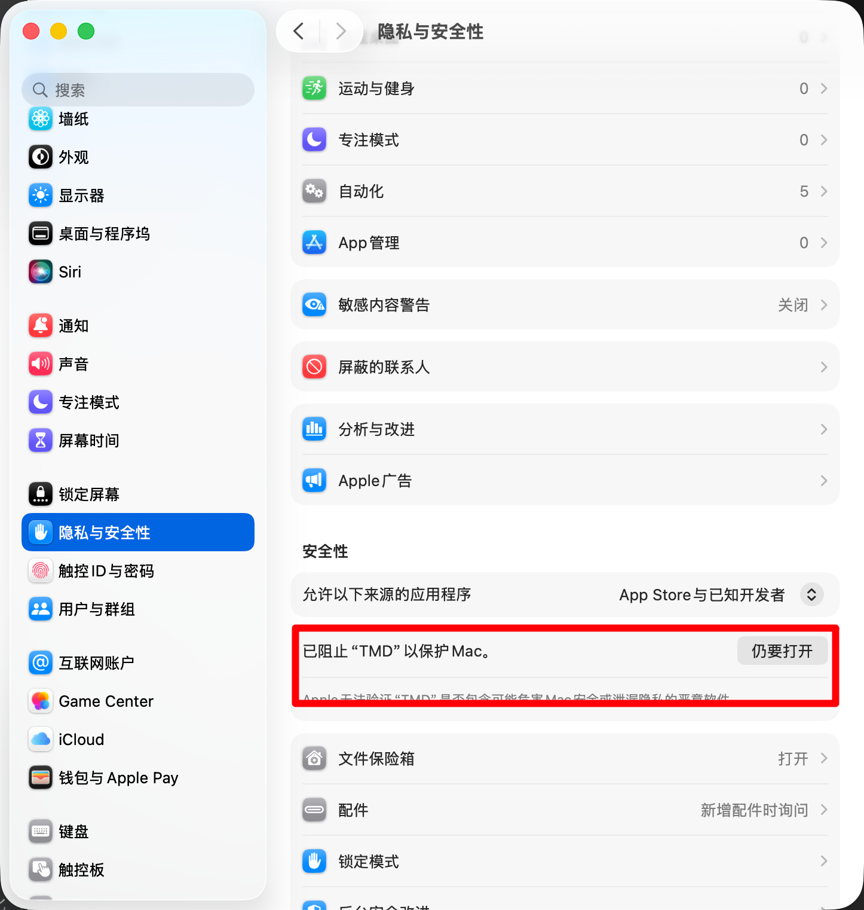
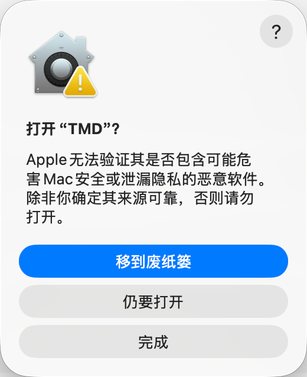

# macOS 安装后无法打开 TMD（Gatekeeper 拦截）

**适用场景**：从网页（浏览器）下载 dmg 安装、**首次打开**时被系统拦截。通过应用内「检查更新」下载的安装包已在下载时自动清除隔离标记，不会遇到本问题。

## 现象

双击 TMD 提示「未打开"TMD"——Apple 无法验证"TMD"是否包含可能危害 Mac 安全或泄漏隐私的恶意软件」，且只有「完成 / 移到废纸篓」两个按钮：

> 注意：先点「**完成**」关闭弹窗即可，不要点「移到废纸篓」（点了也没关系，重新下载安装包再走一遍下述步骤就行）。

## 解决步骤

1. 打开 **系统设置**，搜索并进入「**隐私与安全性**」；
2. 在「安全性」区找到「**已阻止"TMD"以保护 Mac**」，点右侧「**仍要打开**」：

    

3. 弹出确认框「打开"TMD"?」，再次点「**仍要打开**」：

    

4. 输入密码（或触控 ID）确认后，TMD 即可正常打开。

**只需放行一次**，之后打开不会再拦截。

## 背景

TMD 为免费分发、未做 Apple 公证，采用 ad-hoc 签名；从网页下载的安装包带「隔离标记」（quarantine），Gatekeeper 据此拦截未公证应用的首次打开。通过应用内「检查更新」下载的安装包会在落盘后自动清除该标记，不受影响。签名与公证的完整决策记录见 [打包发布.md §4.1](打包发布.md)。
