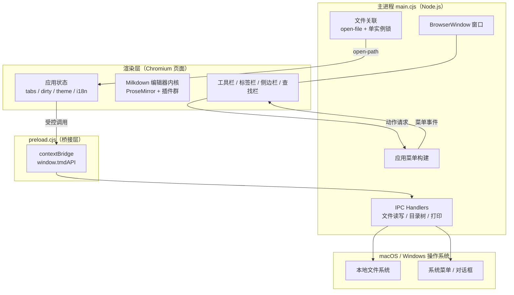
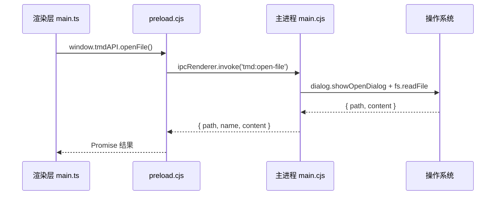
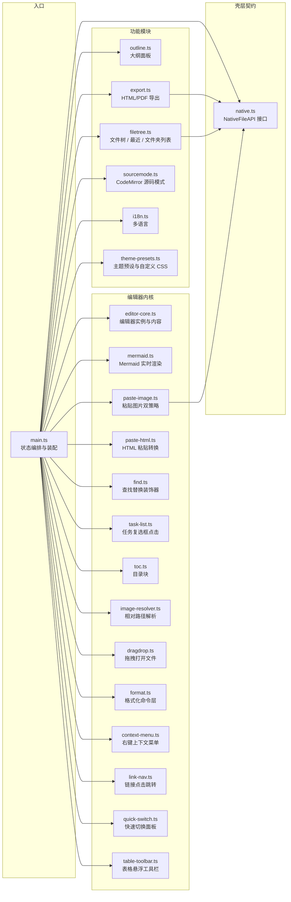
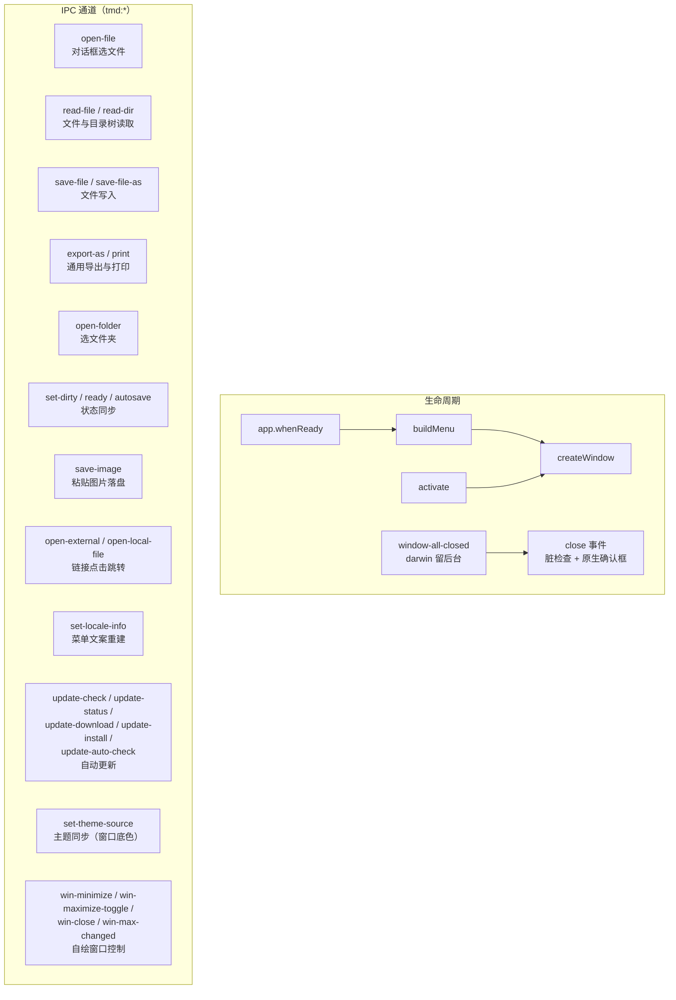

# TMD 架构设计

> 版本：1.2　作者：chiangyang　更新：2026-09-12
> 相关文档：[需求说明](需求说明.md)　[详细设计](详细设计.md)　[路线图](路线图.md)　[打包发布](打包发布.md)　[git 多远程同步](git-multi-remote.md)

## 1. 系统概览

TMD 是一个跨平台（macOS / Windows）的 Markdown 所见即所得编辑器，核心特性是 Mermaid 图表的实时渲染。整体为 **Electron 三层架构**：主进程（壳）、preload 桥、渲染层（编辑器内核），层间只通过受控的 IPC 契约通信。



## 2. 技术选型与理由

| 层 | 技术 | 选型理由 |
|---|---|---|
| 桌面壳 | Electron 44 | 中文输入法兼容性久经验证；Mac/Windows 渲染绝对一致；生态成熟 |
| 语言 | TypeScript（全栈单语言） | 渲染层与主进程同语言；类型即文档 |
| 编辑器内核 | Milkdown 7（ProseMirror） | Markdown 语法与所见即所得双向映射成熟；插件体系完整 |
| 图表渲染 | mermaid 11（自研节点视图） | 官方 diagram 插件不含渲染视图，自研可控防抖/错误兜底/点击编辑 |
| 代码高亮 | @milkdown/plugin-prism（refractor） | 编辑态即高亮态，光标进入直接改源码 |
| 公式 | @milkdown/plugin-math（KaTeX） | 行内/块级公式实时渲染 |
| 源码模式 | CodeMirror 6 | 行业界标准源码编辑器，自带搜索面板 |
| 构建 | Vite + electron-builder | 秒级热更新开发；双平台打包 |
| 包体积优化 | 依赖全部置于 devDependencies | vite 已将依赖编译进 dist，避免 node_modules 双份入包（489MB → 293MB） |

## 3. 进程模型与通信设计

Electron 出于安全默认**渲染层无 Node 权限**（contextIsolation: true）。所有系统能力经过三层传递：



**契约要点**：

1. 渲染层只依赖 `src/native.ts` 声明的 `NativeFileAPI` 接口，接口即壳层契约——未来迁移 Tauri 等其他壳时仅需重写该接口的实现
2. 浏览器环境无 `window.tmdAPI`，各文件操作自动降级（文件选择用 `<input>`、保存用下载）
3. 主进程 → 渲染层的反向事件同样走 IPC：菜单点击（`tmd:menu`）、自动保存开关、文件关联打开（`tmd:open-path`）

## 4. 渲染层模块图



各模块职责：

| 模块 | 职责 | 关键导出 |
|---|---|---|
| `main.ts` | 纯装配入口：boot 启动、hooks/上下文注入、快捷键、菜单回调、侧边栏切换 | `boot()` |
| `editor-core.ts` | 编辑器枢纽：实例创建/销毁/重建、源码模式、内容取回；文档变更经 hooks 回调外部 | `mountEditor`、`replaceEditor`、`currentMarkdown`、`setSourceMode`、`setEditorHooks` |
| `tabs.ts` | 标签页状态机：创建/激活/关闭、标签栏渲染、标题与脏状态、每标签滚动位置暂存/恢复 | `newTab`、`activateTab`、`closeTab`、`updateTitle`、`markDirty` |
| `files.ts` | 文件操作：打开/保存、多文件夹工作区（追加挂载/展开懒加载/单条移除/清空）、最近列表（原生对话框 + 浏览器降级） | `openDocument`、`saveDocument`、`openFolder`、`renderFilesSidebar`、`getFolderTrees` |
| `store.ts` | localStorage 键与读写统一入口（恢复副本/主题/最近列表/文件夹列表/图片策略/自动保存） | `saveDoc`、`recentList`、`pushRecent`、`folderList`、`pushFolder` 等 |
| `theme.ts` | 深浅模式切换：CSS 变量 + mermaid 主题 + 图表原地重渲（不重建编辑器） | `applyTheme`、`isDarkTheme` |
| `theme-presets.ts` | 主题预设（简约白/深色/羊皮纸/护眼绿，CSS 变量覆盖注入）与自定义 CSS 注入，即时生效不触碰编辑器实例 | `changeThemePreset`、`applyCustomCss`、`restoreThemeStyles` |
| `findbar.ts` | 查找栏 DOM 装配与交互（源码模式留给 CodeMirror 搜索） | `openFindBar`、`wireFindBar` |
| `settings.ts` | 设置面板：配置反射与语言/主题列表/自定义 CSS/自动保存/图片策略/更新状态的事件装配 | `openSettings`、`wireSettings` |
| `autosave.ts` | 自动保存：5 秒写回定时器，设置与菜单共用单入口 | `initAutosave`、`setAutosaveOn` |
| `mermaid.ts` | Mermaid 节点 schema + 节点视图（渲染/防抖/错误兜底/点击编辑）+ 输入规则 + 主题原地重渲 | `mermaidPlugins`、`setMermaidTheme`、`reThemeMermaid` |
| `find.ts` | 查找高亮装饰器、匹配计数、跳转、单个/全部替换 | `findPlugin`、`findSetQuery` 等 |
| `outline.ts` | 收集 1-3 级标题、渲染大纲列表、点击跳转 | `collectOutline`、`renderOutline` |
| `filetree.ts` | 文件夹树、最近文件列表、已打开文件夹列表（多根）的纯渲染 | `renderFileTree`、`renderRecent`、`renderFolders` |
| `export.ts` | markdown → 独立 HTML（CDN mermaid/KaTeX）；系统打印导出 PDF | `exportHtml`、`exportPdf` |
| `sourcemode.ts` | CodeMirror 6 源码模式实例创建 | `createSourceEditor` |
| `paste-image.ts` | 剪贴板图片插入：inline data URL / assets 落盘双策略（未落盘或失败自动降级 inline）；paste 时刻捕获选区防异步竞态 | `pasteImage`、`setImagePasteContext` |
| `paste-html.ts` | HTML 粘贴转换：text/html 白名单清洗后按 schema parseDOM 规则转 slice；链接/图片协议白名单，失败降级纯文本 | `pasteHtml`、`isSafeHref`、`isSafeImageSrc` |
| `task-list.ts` | 任务列表复选框点击热区判定，翻转 checked 属性（标准事务，可撤销） | `taskListClick` |
| `toc.ts` | 目录块：remark 区间识别、原子节点、动态视图、点击跳转、序列化填充 | `tocPlugins`、`insertToc`、`fillTocBlocks` |
| `image-resolver.ts` | 文档内相对路径图片按文档所在目录解析为可显示 src | `setImageBaseDir`、`imageSrcResolver` |
| `dragdrop.ts` | 拖拽打开文件：拖 .md 进窗口新标签打开，拖图片按粘贴策略插入；window 捕获阶段仅拦截携带文件的拖放 | `wireDragDrop`、`classifyDroppedFiles` |
| `format.ts` | 格式化命令层：快捷键 keymap 与主菜单「格式」栏统一分发（标题/加粗/斜体/行内代码/链接/引用/列表/代码块），可撤销标准事务 | `applyFormatAction`、`formatKeymap`、`toggleLink` |
| `context-menu.ts` | 编辑区右键菜单：剪切/复制/粘贴 + 按选区/链接上下文动态显隐的格式化项（复用 format.ts 命令） | `wireContextMenu`、`resolveMenuEntries`、`closeContextMenu` |
| `link-nav.ts` | 链接点击跳转：Mod+点击链接 → 外部 URL 走 openExternal（http/https 白名单）、本地路径按文档目录解析走 openPath | `linkNav`、`resolveLink`、`wireLinkNav` |
| `quick-switch.ts` | 快速切换面板：Ctrl/Cmd+P 唤起，标签/多棵已展开文件夹树/最近列表合并去重，fzf 式子序列模糊搜索，回车打开 | `fuzzyScore`、`openQuickSwitch`、`wireQuickSwitch` |
| `table-toolbar.ts` | 表格悬浮工具栏：光标入表弹出（行/列增删、当前列对齐），命令复用 prosemirror-tables；删行/列与对齐先构造整行/列 CellSelection（单事务单步撤销） | `tableToolbar`、`runTableAction`、`findTableContext` |
| `table-markdown.ts` | 表格 Markdown 规范化：清空仅含 `<br />` 占位的空单元格（currentMarkdown 出口与变更钩子双调用点） | `normalizeEmptyTableCells` |
| `text-escaping.ts` | 文本转义补丁：覆盖 stringify 的 `text` handler，去掉 milkdown 的「末尾空白即原样输出」早退捷径，恢复 `|` 等标点在表格单元格内的转义 | `patchTextEscaping`、`safeTextHandler` |
| `i18n.ts` | 语言包加载、`t()` 取词、DOM 批量替换、菜单文案导出 | `t`、`applyDomTexts`、`menuLabels` |
| `native.ts` | 壳层契约接口类型 + 引用 | `native` |

## 5. Electron 主进程设计



关键设计决策：

| 决策 | 理由 |
|---|---|
| 关闭确认在主进程用原生对话框 | 渲染层 `window.confirm` 在 Electron 关闭流程中不可靠，会静默吞掉关闭动作导致窗口无法关闭 |
| 渲染层 `ready` 信号后才下发排队的打开文件 | 消除"启动"与"文件打开"的时序竞态（此前可能挂载两个编辑器实例） |
| 菜单文案由渲染层下发重建 | 渲染层是语言唯一事实源，主进程无需读语言包文件 |
| 菜单文案默认中文兜底 | 渲染层加载完成前菜单先以中文呈现（<1s） |
| 文件关联 `fileAssociations` + 单实例锁 | Finder 双击 .md 直接在本应用打开；已运行时新开文件转交现有窗口 |
| `will-navigate` 一律 preventDefault | 拖文件进窗口时 Chromium 默认导航到该文件；渲染层 drop 处理器已拦截，主进程兜底漏网情况（应用为单页，无合法导航） |
| 拖入文件路径经 preload `webUtils.getPathForFile` 解析 | Electron 32+ 移除了 `File.path`；webUtils 在 preload 同步解析，无需 IPC |
| 格式化命令双路径分发：菜单 accelerator 与 ProseMirror keymap | Electron 下菜单 accelerator 先消费按键，渲染层 keymap 不会重复触发；浏览器模式无菜单栏，keymap 是唯一路径。两路径收敛到 format.ts 同一批命令，源码模式无 ProseMirror 编辑器自然失效（菜单路径由 main.ts 显式拦截） |
| 链接跳转协议白名单：openExternal 仅放行 http/https | 防 `file:` / `javascript:` 等任意协议经系统打开器注入；本地文件走独立的 openLocalFile 通道（shell.openPath），路径由渲染层按当前文档目录解析为绝对路径 |
| HTML 粘贴三重过滤：DOMParser 清洗 → 协议白名单 → schema parseDOM | DOMParser 为 inert 文档不执行脚本；清洗剥除 script/style 子树与排版壳标签、属性仅留 a[href]/img[src,alt]；最终只按 schema 生成节点，导出侧另有 html:false 兜底 |
| Windows/Linux 标题栏完全自绘（`titleBarStyle: 'hidden'`） | 原生标题栏由系统独立绘制，主题切换无法与内容区同帧变色；自绘后标题区属于页面，一次重绘全部同步 |
| 自动更新不静默下载 | 发现新版本弹窗询问，用户同意后才下载安装；默认 Gitee 源（国内），出错自动切换 GitHub 源 |

## 6. 目录结构

```
TMD/
├── electron/                    # Electron 壳层
│   ├── main.cjs                 # 主进程：窗口、菜单、IPC、主题、自动更新
│   ├── ipc.cjs                  # IPC 通道名常量（主进程与 preload 共用）
│   └── preload.cjs              # 桥接层：contextBridge 暴露受控 API
├── public/
│   └── boot.js                  # 首帧引导：html.dark / html.win|mac 平台类（防启动白闪）
├── src/                         # 渲染层（纯网页，壳层无关）
│   ├── main.ts                  # 入口：纯装配（boot / hooks 注入 / 快捷键 / 菜单回调）
│   ├── editor-core.ts           # 编辑器枢纽（创建/重建/源码模式/内容取回）
│   ├── tabs.ts                  # 标签页状态机（含每标签滚动位置）
│   ├── files.ts                 # 文件操作（打开/保存/多文件夹工作区/最近列表）
│   ├── store.ts                 # localStorage 读写统一入口
│   ├── theme.ts                 # 深浅模式切换（mermaid 原地重渲，不重建编辑器）
│   ├── theme-presets.ts         # 主题预设与自定义 CSS 注入
│   ├── findbar.ts               # 查找栏装配
│   ├── settings.ts              # 设置面板装配（语言/主题列表/CSS/更新）
│   ├── autosave.ts              # 自动保存定时器
│   ├── mermaid.ts               # Mermaid 实时渲染插件（核心）
│   ├── find.ts                  # 查找替换（装饰器实现）
│   ├── outline.ts               # 大纲面板
│   ├── filetree.ts              # 文件树 / 最近文件 / 已打开文件夹渲染
│   ├── export.ts                # HTML / PDF 导出
│   ├── sourcemode.ts            # CodeMirror 源码模式
│   ├── paste-image.ts           # 粘贴图片（inline / assets 双策略）
│   ├── paste-html.ts            # HTML 粘贴转换（白名单清洗 → schema 解析）
│   ├── task-list.ts             # 任务列表复选框点击切换
│   ├── toc.ts                   # 目录（TOC）块
│   ├── image-resolver.ts        # 图片相对路径解析
│   ├── dragdrop.ts              # 拖拽打开文件（.md 打开 / 图片插入）
│   ├── format.ts                # 格式化命令层（快捷键 keymap + 格式菜单分发）
│   ├── context-menu.ts          # 编辑区右键上下文菜单
│   ├── link-nav.ts              # 链接点击跳转（Mod+点击，外部/本地分发）
│   ├── quick-switch.ts          # 快速切换面板（Ctrl+P 模糊搜索）
│   ├── table-toolbar.ts         # 表格悬浮工具栏（行列增删 / 对齐）
│   ├── table-markdown.ts        # 表格 Markdown 规范化（空单元格 <br/> 清理）
│   ├── text-escaping.ts         # 文本转义补丁（覆盖 stringify text handler）
│   ├── i18n.ts                  # 多语言运行时
│   ├── native.ts                # 壳层契约接口
│   ├── locales/                 # 语言包（zh-CN / en）
│   ├── __tests__/               # vitest 纯函数单元测试
│   └── style.css                # 全部样式（CSS 变量深浅主题）
├── index.html                   # 页面结构
├── docs/                        # 文档（本目录）
├── dist/                        # vite 构建产物（gitignore）
└── release/                     # 打包产物（gitignore）
```

## 7. 关键横切关注点

| 关注点 | 方案 | 位置 |
|---|---|---|
| 脏检测 | 编辑事件驱动的 per-tab 脏标记（序列化比对会因规范化产生误报，已弃用）；文档变更经 editor-core hooks 回调 tabs.markDirty | `editor-core.ts` / `tabs.ts` |
| 崩溃兜底 | 文档内容每次变更即写 localStorage（与磁盘保存无关） | `store.ts` saveDoc |
| 主题切换 | CSS 变量切换 + mermaid 视图原地重渲（不重建编辑器，保住撤销历史/焦点/滚动位置）；主题预设与自定义 CSS 为纯 CSS 变量注入层，同样不触碰编辑器实例 | `theme.ts` / `mermaid.ts` / `theme-presets.ts` |
| 安全 | contextIsolation、渲染层零 Node、mermaid securityLevel strict、markdown-it html:false、主进程注入 CSP 头（`script-src 'self'` 禁 eval/内联脚本） | `electron/` / `export.ts` |
| 性能 | mermaid 渲染 400ms 防抖 + 序号守卫丢弃过期结果；按需懒加载图表模块 | `mermaid.ts` |
| 中文输入 | 编辑内核选型即为此服务；所有输入路径以中文输入法为一等公民测试 | 全局 |
