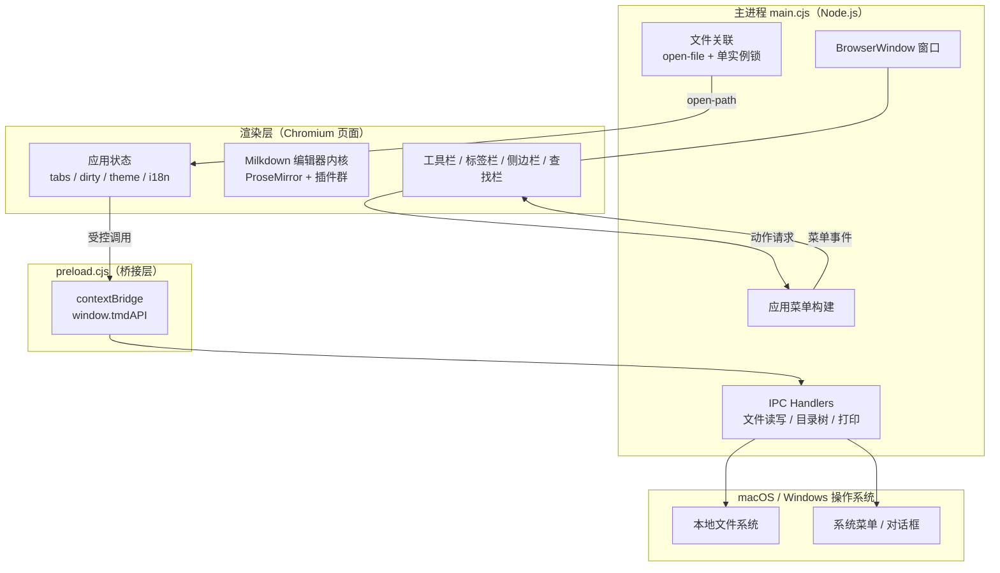
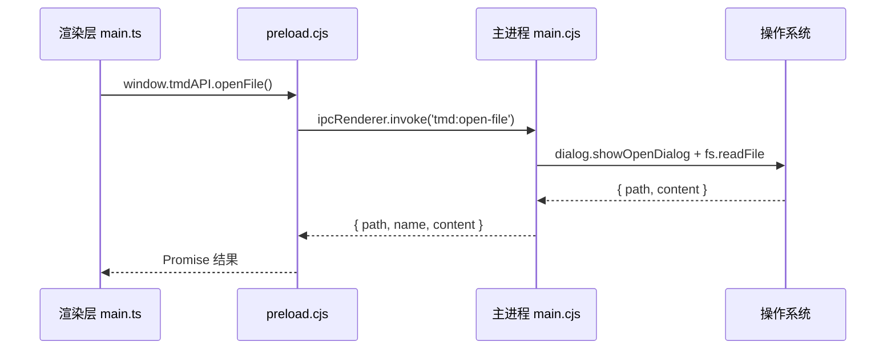
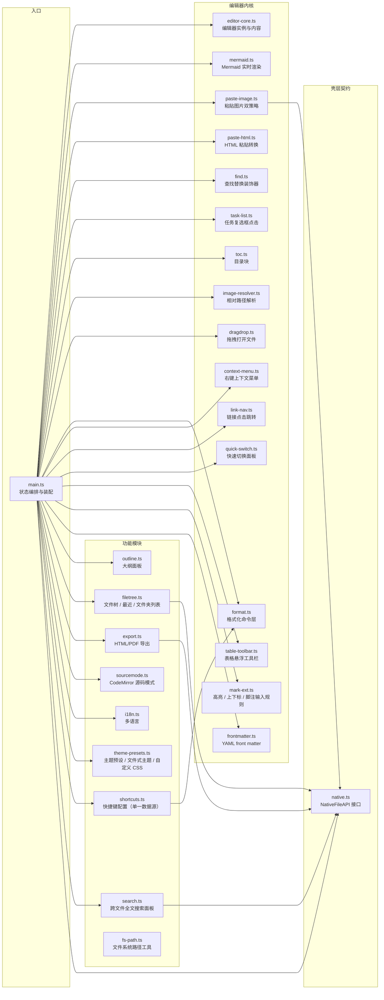
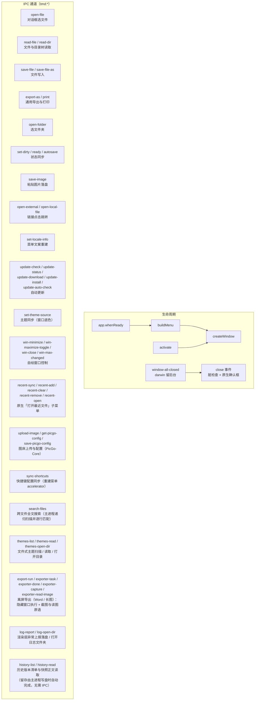

# TMD 架构设计

> 版本：2.1　作者：chiangyang　更新：2026-09-19
> 相关文档：[需求说明](需求说明.md)　[详细设计](详细设计.md)　[路线图](路线图.md)　[打包发布](打包发布.md)　[git 多远程同步](git-multi-remote.md)

## 1. 系统概览

TMD 是一个跨平台（macOS / Windows）的 Markdown 所见即所得编辑器，核心特性是 Mermaid 图表的实时渲染。整体为 **Electron 三层架构**：主进程（壳）、preload 桥、渲染层（编辑器内核），层间只通过受控的 IPC 契约通信。



## 2. 技术选型与理由

| 层 | 技术 | 选型理由 |
|---|---|---|
| 桌面壳 | Electron 44 | 中文输入法兼容性久经验证；Mac/Windows 渲染绝对一致；生态成熟 |
| 语言 | TypeScript（全栈单语言） | 渲染层与主进程同语言；类型即文档 |
| 编辑器内核 | Milkdown 7（ProseMirror） | Markdown 语法与所见即所得双向映射成熟；插件体系完整 |
| 图表渲染 | mermaid 11（自研节点视图） | 官方 diagram 插件不含渲染视图，自研可控防抖/错误兜底/点击编辑 |
| 代码高亮 | @milkdown/plugin-prism（refractor） | 编辑态即高亮态，光标进入直接改源码 |
| 公式 | @milkdown/plugin-math（KaTeX） | 行内/块级公式实时渲染 |
| 源码模式 | CodeMirror 6 | 行业界标准源码编辑器，自带搜索面板 |
| 构建 | Vite + electron-builder | 秒级热更新开发；双平台打包 |
| 自动更新 | electron-updater | 双源（Gitee 优先 / GitHub 兜底）、blockmap 增量更新；主进程运行时依赖 |
| 图床上传 | PicGo-Core | 复用其内置的 7 种图床实现与配置格式，无需自维护各家 API；渲染层零 Node 权限，上传统一在主进程完成 |
| 包体积优化 | 渲染层依赖全置于 devDependencies，仅主进程运行时依赖保留在 dependencies | vite 已将渲染层依赖编译进 dist，避免 node_modules 双份入包（489MB → 293MB）；asar 内只保留主进程真正 require 的模块 |
| 安装包瘦身 | afterPack 钩子裁剪 Electron 运行时（`scripts/trim-runtime.cjs`） | 删 53 个语言包、LICENSES.chromium.html、WebGL/Vulkan 相关 DLL；Windows 安装包 108MB → 93MB，适配 Gitee 附件 100MB 上限 |

## 3. 进程模型与通信设计

Electron 出于安全默认**渲染层无 Node 权限**（contextIsolation: true）。所有系统能力经过三层传递：



**契约要点**：

1. 渲染层只依赖 `src/native.ts` 声明的 `NativeFileAPI` 接口，接口即壳层契约——未来迁移 Tauri 等其他壳时仅需重写该接口的实现
2. 浏览器环境无 `window.tmdAPI`，各文件操作自动降级（文件选择用 `<input>`、保存用下载）
3. 主进程 → 渲染层的反向事件同样走 IPC：菜单点击（`tmd:menu`）、自动保存开关、文件关联打开（`tmd:open-path`）

## 4. 渲染层模块图



各模块职责：

| 模块 | 职责 | 关键导出 |
|---|---|---|
| `main.ts` | 纯装配入口：boot 启动、hooks/上下文注入、快捷键分发、菜单回调、侧边栏切换；启动时把快捷键配置同步给主进程重建菜单 | `boot()` |
| `editor-core.ts` | 编辑器枢纽：实例创建/销毁/重建、源码模式、内容取回；文档变更经 hooks 回调外部 | `mountEditor`、`replaceEditor`、`currentMarkdown`、`setSourceMode`、`jumpToSourceMatch`、`setEditorHooks` |
| `tabs.ts` | 标签页状态机：创建/激活/关闭、标签栏渲染、标题与脏状态、每标签滚动位置暂存/恢复 | `newTab`、`activateTab`、`closeTab`、`updateTitle`、`markDirty` |
| `files.ts` | 文件操作：打开/保存、多文件夹工作区（追加挂载/展开懒加载/单条移除/清空）、最近列表（原生对话框 + 浏览器降级） | `openDocument`、`saveDocument`、`openFolder`、`renderFilesSidebar`、`getFolderTrees` |
| `store.ts` | localStorage 键与读写统一入口（恢复副本/主题/最近列表/文件夹列表/图片策略/自动保存） | `saveDoc`、`recentList`、`pushRecent`、`folderList`、`pushFolder` 等 |
| `theme.ts` | 深浅模式切换：CSS 变量 + mermaid 主题 + 图表原地重渲（不重建编辑器） | `applyTheme`、`isDarkTheme` |
| `theme-presets.ts` | 三层主题覆盖链：内置预设（简约白/深色/羊皮纸/护眼绿，CSS 变量覆盖注入）、文件式主题（~/.tmd/themes/*.css 原样注入，与预设互斥、不联动深浅）、自定义 CSS（最高优先级），即时生效不触碰编辑器实例 | `changeThemePreset`、`changeFileTheme`、`applyFileTheme`、`restoreThemeStyles`、`restoreFileTheme`、`resolveThemeSelection` |
| `findbar.ts` | 查找栏 DOM 装配与交互（源码模式留给 CodeMirror 搜索） | `openFindBar`、`wireFindBar` |
| `settings.ts` | 设置面板：配置反射与语言/主题列表/自定义 CSS/自动保存/图片策略/图床配置/快捷键自定义/更新状态/关于信息的事件装配；双栏分类导航联动（点击定位 / 滚动高亮跟随，见详细设计 §28） | `openSettings`、`wireSettings`、`PICGO_FIELDS` |
| `autosave.ts` | 自动保存：5 秒写回定时器，设置与菜单共用单入口 | `initAutosave`、`setAutosaveOn` |
| `mermaid.ts` | Mermaid 节点 schema + 节点视图（渲染/防抖/错误兜底/点击编辑）+ 输入规则 + 主题原地重渲 | `mermaidPlugins`、`setMermaidTheme`、`reThemeMermaid` |
| `find.ts` | 查找高亮装饰器、匹配计数、跳转、单个/全部替换；另导出纯文本匹配 `findTextRanges`（源码模式搜索定位复用） | `findPlugin`、`findSetQuery`、`findTextRanges` 等 |
| `outline.ts` | 收集 1-3 级标题、渲染大纲列表、点击跳转 | `collectOutline`、`renderOutline` |
| `filetree.ts` | 文件夹树、最近文件列表、已打开文件夹列表（多根）的纯渲染 | `renderFileTree`、`renderRecent`、`renderFolders` |
| `export.ts` | 主窗口侧导出动作：HTML（CDN 外壳 + 内联样式）、PDF（系统打印）、Word / 长图（采集主题快照与文档目录后交离屏导出服务）；渲染与样式规则不在此层 | `exportHtml`、`exportPdf`、`exportWord`、`exportLongimage`、`buildExportHtml` |
| `export-doc.ts` | 载体无关的导出文档核心（单一数据源）：markdown-it 管线（含公式保护规则）、主题变量快照、导出样式表、图片引用分类纯函数；HTML 外壳与离屏页共用 | `buildExportDocument`、`renderMarkdown`、`collectThemeVars`、`resolveExportImageRef`、`stripFrontMatter` |
| `export-word.ts` | Word 适配 + 转换（转换器隔离于此）：复杂视觉块区域截帧栅格化、远程图片解析器、dom-docx（computed 样式 / A4 / 告警收集） | `buildDocxBytes`、`rasterizeVisualBlocks` |
| `export-image.ts` | 长图：分段计划纯函数（含清晰度归一与上限）与 canvas 纵向拼接（依赖注入截图原语） | `planSegments`、`zoomForDpr`、`composeLongPng` |
| `export-renderer.ts` | 离屏导出页引导：注入文档 → 图片本地化 → KaTeX → 字体就绪 → Mermaid → 按任务种类分派（策略） | 页面入口（订阅任务并回传结果） |
| `export-bridge.ts` | 离屏页与主进程 exporter 服务之间的桥接契约（任务、结果、截图与读图原语） | `ExportTask`、`ExporterBridge`、`CaptureRequest` |
| `sourcemode.ts` | CodeMirror 6 源码模式实例创建 | `createSourceEditor` |
| `paste-image.ts` | 剪贴板图片插入：inline data URL / assets 落盘 / 图床上传三策略（未落盘或上传失败自动降级 inline）；paste 时刻捕获选区防异步竞态 | `pasteImage`、`setImagePasteContext` |
| `paste-html.ts` | HTML 粘贴转换：text/html 白名单清洗后按 schema parseDOM 规则转 slice；链接/图片协议白名单，失败降级纯文本 | `pasteHtml`、`isSafeHref`、`isSafeImageSrc` |
| `task-list.ts` | 任务列表复选框点击热区判定，翻转 checked 属性（标准事务，可撤销） | `taskListClick` |
| `toc.ts` | 目录块：remark 区间识别、原子节点、动态视图、点击跳转、序列化填充 | `tocPlugins`、`insertToc`、`fillTocBlocks` |
| `image-resolver.ts` | 文档内相对路径图片按文档所在目录解析为可显示 src | `setImageBaseDir`、`imageSrcResolver` |
| `dragdrop.ts` | 拖拽打开文件：拖 .md 进窗口新标签打开，拖图片按粘贴策略插入；window 捕获阶段仅拦截携带文件的拖放 | `wireDragDrop`、`classifyDroppedFiles` |
| `format.ts` | 格式化命令层：快捷键与主菜单「格式」栏统一分发（标题/加粗/斜体/行内代码/链接/引用/列表/代码块），可撤销标准事务；keymap 用 `handleKeyDown` 实时读 shortcuts 配置，用户改键即时生效、无需重建编辑器 | `applyFormatAction`、`formatKeymap`、`toggleLink` |
| `context-menu.ts` | 编辑区右键菜单：剪切/复制/粘贴 + 按选区/链接上下文动态显隐的格式化项（复用 format.ts 命令） | `wireContextMenu`、`resolveMenuEntries`、`closeContextMenu` |
| `link-nav.ts` | 链接点击跳转：Mod+点击链接 → 外部 URL 走 openExternal（http/https 白名单）、本地路径按文档目录解析走 openPath | `linkNav`、`resolveLink`、`wireLinkNav` |
| `quick-switch.ts` | 快速切换面板：Ctrl/Cmd+P 唤起，标签/多棵已展开文件夹树/最近列表合并去重，fzf 式子序列模糊搜索，回车打开 | `fuzzyScore`、`openQuickSwitch`、`wireQuickSwitch` |
| `table-toolbar.ts` | 表格悬浮工具栏：光标入表弹出（行/列增删、当前列对齐），命令复用 prosemirror-tables；删行/列与对齐先构造整行/列 CellSelection（单事务单步撤销） | `tableToolbar`、`runTableAction`、`findTableContext` |
| `table-markdown.ts` | 表格 Markdown 规范化：清空仅含 `<br />` 占位的空单元格（currentMarkdown 出口与变更钩子双调用点） | `normalizeEmptyTableCells` |
| `text-escaping.ts` | 文本转义补丁：覆盖 stringify 的 `text` handler，去掉 milkdown 的「末尾空白即原样输出」早退捷径，恢复 `|` 等标点在表格单元格内的转义 | `patchTextEscaping`、`safeTextHandler` |
| `mark-ext.ts` | 语法扩展（remark 插件 + schema + 输入规则）：`==高亮==`、上/下标——`^x^`/`~x~` 与 `^{x}`/`_{x}` 双写法均识别，序列化统一为 Pandoc 单符号风格；行内代码/公式未闭合跨度内不激活（防误触）。另补齐 gfm preset 缺失的脚注输入路径：行内 `[^label]` 引用原子化、`[^label]: ` 整段转定义块（整段替换无空壳残留）、定义块段尾 Enter 退出到正文 | `markPlugins`、`inUnclosedSpan`、`FOOTNOTE_REF_RE`、`FOOTNOTE_DEF_RE` |
| `frontmatter.ts` | YAML front matter：remark 解析 + 原子节点 + NodeView 双态（键值属性表 ⇄ 点击进 YAML 文本编辑）、`---` 输入规则；非法 YAML 提示并保留原文；序列化字节级原样写回（保存不重排） | `frontmatterPlugins`、`frontmatterInputRule`、`validateFrontMatter` |
| `i18n.ts` | 语言包加载（zh-CN / zh-Hant / en）、`t()` 取词、DOM 批量替换、`<html lang>` 同步、菜单文案与语言码导出（主进程据此重建菜单并选文件树排序区域） | `t`、`applyDomTexts`、`menuLabels`、`getLocale` |
| `shortcuts.ts` | 快捷键配置的单一数据源：31 项定义（action / i18n 路径 / 默认值 / 分组）、localStorage 读写与重置、按键事件 ⇄ accelerator 互转、合法性与冲突校验、显示格式化（Windows 加号连接 / macOS 苹果 HIG 符号顺序） | `SHORTCUT_DEFS`、`loadShortcuts`、`saveShortcuts`、`formatAccelerator`、`eventToAccelerator`、`findConflict` |
| `search.ts` | 跨文件全文搜索面板：收集已挂载文件夹为根目录、300ms 输入防抖、序号守卫丢弃过期结果、结果按文件分组渲染（关键词高亮）、回车/点击跳转；打开文件后在实时文档内重新匹配定位（磁盘行号不可换算），所见即所得走 `findMatches`、源码模式走 `jumpToSourceMatch` | `openSearch`、`wireSearch`、`splitHighlights`、`groupMatches` |
| `fs-path.ts` | 文件系统路径工具：反斜杠统一、折叠 `.`/`..`、保留 Windows 盘符形态（`normalizeFsPath`）、取目录（`dirOf`）、同一性判断（`isSameFsPath`，Windows 忽略大小写） | `normalizeFsPath`、`dirOf`、`isSameFsPath`、`isWindowsPath` |
| `native.ts` | 壳层契约接口类型 + 引用 | `native` |

## 5. Electron 主进程设计



关键设计决策：

| 决策 | 理由 |
|---|---|
| 关闭确认在主进程用原生对话框 | 渲染层 `window.confirm` 在 Electron 关闭流程中不可靠，会静默吞掉关闭动作导致窗口无法关闭 |
| 渲染层 `ready` 信号后才下发排队的打开文件 | 消除"启动"与"文件打开"的时序竞态（此前可能挂载两个编辑器实例） |
| 菜单文案与排序区域由渲染层下发 | 渲染层是语言唯一事实源，主进程无需读语言包文件；`setLocaleInfo` 同时带语言码，主进程映射为 Intl 排序区域供文件树排序（`zh-Hant` 必须落 `zh-TW` 才走笔画/部首序） |
| 菜单文案默认中文兜底 | 渲染层加载完成前菜单先以中文呈现（<1s） |
| 文件关联 `fileAssociations` + 单实例锁 | Finder 双击 .md 直接在本应用打开；已运行时新开文件转交现有窗口 |
| `will-navigate` 一律 preventDefault | 拖文件进窗口时 Chromium 默认导航到该文件；渲染层 drop 处理器已拦截，主进程兜底漏网情况（应用为单页，无合法导航） |
| 拖入文件路径经 preload `webUtils.getPathForFile` 解析 | Electron 32+ 移除了 `File.path`；webUtils 在 preload 同步解析，无需 IPC |
| 格式化命令双路径分发：菜单 accelerator 与 ProseMirror keymap | Electron 下菜单 accelerator 先消费按键，渲染层 keymap 不会重复触发；浏览器模式无菜单栏，keymap 是唯一路径。两路径收敛到 format.ts 同一批命令，源码模式无 ProseMirror 编辑器自然失效（菜单路径由 main.ts 显式拦截）。两条路径读同一份 `shortcuts.ts` 配置，用户改键后行为一致 |
| 链接跳转协议白名单：openExternal 仅放行 http/https | 防 `file:` / `javascript:` 等任意协议经系统打开器注入；本地文件走独立的 openLocalFile 通道（shell.openPath），路径由渲染层按当前文档目录解析为绝对路径 |
| HTML 粘贴三重过滤：DOMParser 清洗 → 协议白名单 → schema parseDOM | DOMParser 为 inert 文档不执行脚本；清洗剥除 script/style 子树与排版壳标签、属性仅留 a[href]/img[src,alt]；最终只按 schema 生成节点，导出侧另有 html:false 兜底 |
| Windows/Linux 标题栏完全自绘（`titleBarStyle: 'hidden'`） | 原生标题栏由系统独立绘制，主题切换无法与内容区同帧变色；自绘后标题区属于页面，一次重绘全部同步 |
| 自动更新不静默下载 | 发现新版本弹窗询问，用户同意后才下载安装；默认 Gitee 源（国内），出错自动切换 GitHub 源 |
| 快捷键配置以渲染层 localStorage 为权威，单向同步主进程 | 与主题/语言等设置同源，避免双份存储不一致；主进程只保留运行时副本用于重建菜单 accelerator，不落盘。主进程菜单文案语言也走同一模式 |
| 快捷键显示按平台惯例格式化 | 同一份 accelerator 在 Windows 显示 `Ctrl+Shift+O`、macOS 显示 `⇧⌘O`（苹果 HIG 的 ⌃⌥⇧⌘ 顺序）；用户改键后同一份配置渲染两处，不会出现面板与系统菜单栏写法不一致 |
| 图床上传放在主进程（PicGo-Core） | PicGo 需 Node 运行时（依赖 fs/网络），渲染层零 Node 权限；渲染层只传 base64，主进程写临时文件后交给 PicGo，上传结果仍走同一 IPC 契约。配置文件存 `userData/picgo-config.json`（随卸载清理），不污染用户 home 下的 PicGo 配置 |
| 关于界面自行展示 Chromium/第三方许可证链接 | 安装包瘦身移除了 `LICENSES.chromium.html`（19.5MB），改由「关于」页提供许可证链接以履行展示义务 |
| 全文搜索放主进程执行并设多重上限 | 渲染层无 Node 权限；大工作区扫描会长时间占用，故设目录跳过表（依赖/版本库/构建产物 + 隐藏项）、单文件 2MB、扫描 5000 文件、命中 500 行与 8 路受限并发；超限返回已找到的部分并标记 `truncated`，不做全量阻塞扫描。扫描与匹配逻辑独立为 `electron/search.cjs`（纯 Node，可脱壳验证） |
| 搜索结果按「同文档重新匹配」定位 | 主进程返回的是原始 markdown 的行号，与 ProseMirror 位置不可换算（frontmatter 被剥离、`#`/`*` 等语法字符不占位）。故主进程额外返回文件内序号 `occurrence`，渲染层打开文件后用 `findMatches` 在同文档内重新匹配取第 N 个，滚动统一用 `scrollEditorPosIntoView`（PM 自带的 `scrollIntoView` 对 `.page-scroll` 无效） |
| 新增 `fs-path.ts` 统一文件系统路径处理 | 此前 quick-switch / link-nav / tabs 各有一套路径截断实现且互不一致——Windows 上快速切换面板的「所在目录」恒为空、链接跳转把 `E:\a` 当成相对路径拼接。统一为 `normalizeFsPath` / `dirOf` / `isSameFsPath`，比较与展示前一律先规范化 |
| Word / 长图走独立隐藏窗口的离屏渲染 | 两者都需要"已渲染的结果"（Mermaid 是运行时生成的 SVG、KaTeX 是运行时 span 树），主窗口的编辑器 DOM 不适合直接转换（含 UI 与装饰）。故复用 Electron 自身：隐藏窗口内本地打包 Mermaid/KaTeX（离线可用）、复用导出样式表，天然与导出版式一致 |
| 离屏窗口使用独立内存分区与专用 CSP | 主窗口默认分区的 CSP 不放行 `img-src file:/https:`（导出文档含远程图片）也不适合导出页；独立分区（不加 `persist:` 前缀，退出即清）单独注入放宽图片/字体来源的策略，主窗口的安全策略一字不动 |
| 主进程只提供原语，导出编排全在离屏页 | 主进程能拿到 `capturePage` / `dialog` / `fs` 这类 Electron 独有能力，但分段、等待、拼接、OOXML 转换属于业务逻辑——放在离屏页 TypeScript 侧可被 vitest 直接覆盖，主进程 `exporter.cjs` 保持薄壳（并依赖注入 Electron 能力，使其纯校验函数可脱壳单测，与 search.cjs/themes.cjs 同构） |
| 图表与独占公式用「区域截帧」栅格化而非 canvas | KaTeX 转 Word 文本必走形；Mermaid SVG 含 foreignObject，交给转换器的 canvas 栅格化会因画布污染（`toDataURL` 抛错）失败，自绘 foreignObject 又取不到网页字体。真实合成器截帧是唯一同时保字体、保细节且不触发污染的路线 |
| 长图按纹理上限分段并自纠正偏移 | Chromium 单帧捕获有纹理上限（约 16384 物理像素），超长文档必须分段；段偏移按上一段实际捕获高度推进，窗口管理器钳制视口高度时仍无缝续接；输出清晰度经 `zoom = max(1, 2/dpr)` 归一，跨机器不低于 2x |
| 导出管线的公式原文保护 | markdown-it 的转义规则与上下标插件会二次解释 LaTeX（`\,` 被吞、`x^{2}` 被拆成 `x<sup>{2}</sup>`），导致公式在 HTML / Word / 长图三条路径同时失真；新增 `tmd_math` 内联规则（注册在 `text` 之前）整段保留原文，三路径一并修复 |
| crashReporter 纯本地、零遥传 | 开源个人项目不设收集服务端：`uploadToServer:false` 且无 submitURL，崩溃转储只写 `~/.tmd/crash-dumps`，无崩溃弹窗打扰，设置面板仅提供「打开日志文件夹」。Electron 44 的 `start` 已移除 crashesDirectory 选项，靠 ready 前 `app.setPath('crashDumps', dir)` 重定位；资产根支持 `TMD_HOME_DIR` 环境变量重定位（便携版 / E2E 隔离） |
| 渲染器崩溃监听挂 webContents 而非只挂 app | `app.child-process-gone` 主要覆盖 GPU / utility；`webContents.forcefullyCrashRenderer()` 等渲染器场景只触发 `webContents.render-process-gone`（E2E 实测），后者才是渲染器维度的权威事件，补 `type:'renderer'` 后与统一的日志函数对齐 |
| 主进程自身崩溃靠「下次启动补记」 | 原生崩溃来不及写日志行，故每次 ready 后扫描崩溃目录，未见 .dmp 追加 native-crash 行并以 `.seen-dumps` 清单去重；crashpad 把转储放在 `pending/` 等子目录，扫描必须递归 |
| E2E 不引入 Playwright，复用 CDP | 仓库已有 CDP 驱动的桌面检查脚本（Node 内置 WebSocket 直连 9222/9229），再引一套浏览器自动化框架收益为零、依赖翻倍；抽出共享 `scripts/lib/desktop-harness.mjs`（启动隔离 profile / TMD_HOME_DIR、Cdp 客户端、进程组回收），主链路与导出两套检查复用 |
| 快照产生点放在主进程写盘前 | 若把快照放进渲染层的保存流程，就要在普通保存 / 另存为 / 自动保存各分支分别接一次，浏览器降级路径还得再分叉；放到主进程 `saveFile` / `saveFileAs` 写盘前，只需「读旧内容 → 存档 → 覆盖」三步，渲染层零改动且不漏任何写盘路径 |
| 快照按内容指纹去重而非按时间节流 | 自动保存每 5 秒写盘一次，按时间节流会丢掉窗口内的真实改动、按指纹去重则只在内容真变时留档：既不会刷出上万条重复，也不丢任何一次内容变化 |
| 恢复只改编辑器、不覆盖磁盘 | 「恢复」若直接写盘，用户误点一次就丢掉当前版本；改为把旧版载入编辑器并置脏，由用户确认后自行保存——与「打开文件」同一套心智（改动即脏、保存才落盘） |
| 历史目录用路径哈希命名 | 源文件绝对路径含分隔符，不能直接作目录名；取 sha1 前 16 位，非 Linux 平台统一小写以贴合大小写不敏感的文件系统（避免同一文件分裂成两份历史），因哈希不可逆，目录内用 `index.json` 自描述源路径与文件名，无需全局索引 |
| Mermaid 图表按视口懒渲染 | 打开含数十张图的文档时，节点视图「构造即渲染」会为视口外的图表白白烧掉约 1 秒主线程（实测 30 张 1030ms，8KB 小文档也照烧）。改为 IntersectionObserver 观察，入视口（含一屏预取边距）才渲染并立即断开；代价是滚动到未渲染图表时要即时出图，故首渲不走 400ms 防抖 |
| 分屏采用「一侧编辑、另一侧只读跟随」 | 两侧都可编辑就必须实时双向同步，而 Markdown 往返转换不等价（`* 项目` 序列化回 `- 项目`、`==高亮==` 等）——等于让编辑器持续改写用户手写的源码，还会清空撤销栈、跳光标。改为一侧编辑、另一侧只读跟随，同步就是单向的，且两侧**都不重建编辑器**（CM 只读用创建时 facet、PM 只读用 `setProps`、PM 内容更新走 parser + Slice 事务原地替换且不进撤销历史） |
| 分屏只做「同一文档的两个视图」 | 两个文档并排要把 `activeTabId` / `baseDir` / 查找状态等 10 余处单例按窗格索引（前端 15+ 文件）；而源码与所见即所得共享同一标签与文档，单例无需复制，实际只动 3 个源文件 + 布局。这也是路线图差距表 #9 的原意（「源码 + 预览并排」），与决策记录里搁置的「双文档分屏」不是同一件事 |
| 大文档改动边界由基准数据决定 | 基准实测 1MB 文档打开 474ms、滚动稳定 60 FPS、输入同步 21ms（主因是 Milkdown 对全文重新序列化，不在本仓控制内），均在体感阈值内——故不做列表/代码块虚拟化（要重构 ProseMirror 视图层，风险收益不成比例），只做有数据支撑的 Mermaid 懒渲染，其余记录为已知边界 |
| 设置面板改「左侧分类导航 + 右侧连续滚动」双栏，而非 Tab 子页 | 13 个区块、31 项快捷键塞进 460px 单列后已滚 5 屏且无导航，找设置只能扫读；行号、自动保存等选项归类混乱。双栏方案所有控件 id/事件绑定零改动、桌面 E2E 零适配，改造成本约为 Tab 子页的 1/3；快捷键与许可证两个超长区块由「导航直达 + details 折叠」消化。将来需要时可按 NAV_SECTIONS 映射平滑演进为子页 |
| 设置入口：文件菜单「设置…」+ `Cmd/Ctrl+,`，不进快捷键自定义表 | 平台惯例键位（macOS ⌘, / Windows Ctrl+,）是用户肌肉记忆，开放自定义收益为零；不放 mac 应用菜单是因为 `role: 'appMenu'` 为系统模板无法插入自定义项，手写会丢失本地化角色项——文件菜单跨平台一致。浏览器模式经全局 keydown 兜底同一键位 |

## 6. 目录结构

```
TMD/
├── electron/                    # Electron 壳层
│   ├── main.cjs                 # 主进程：窗口、IPC、主题、自动更新、图床上传、离屏导出装配（菜单模板注入 menu.cjs）
│   ├── menu.cjs                 # 应用菜单模板工厂（纯 Node 纯函数：labels/快捷键/最近文件注入，可独立验证）
│   ├── search.cjs               # 全文搜索的扫描与匹配（纯 Node，可独立验证）
│   ├── themes.cjs               # 文件式主题目录扫描与安全校验（纯 Node，可独立验证）
│   ├── exporter.cjs             # 离屏导出服务：隐藏窗口 + 串行队列 + 截图/读图原语（纯 Node，可独立验证）
│   ├── logger.cjs               # 本地日志与崩溃转储扫描（JSONL 落盘 / 滚动清理 / 去重，纯 Node 可独立验证）
│   ├── history.cjs              # 本地历史版本（写盘前快照 / 指纹去重 / 两层剪枝，纯 Node 可独立验证）
│   ├── ipc.cjs                  # IPC 通道名常量（主进程与 preload 共用）
│   ├── preload.cjs              # 桥接层：contextBridge 暴露受控 API
│   └── exporter-preload.cjs     # 离屏导出页专用桥接（最小权限：4 个方法）
├── export-renderer.html         # 离屏导出页（Word / 长图，隐藏窗口加载）
├── scripts/
│   ├── lib/desktop-harness.mjs  # 桌面 E2E 共享驱动（CDP 客户端 / 隔离启动 / 进程组回收）
│   ├── desktop-app-check.mjs    # 桌面主链路 + 可靠性 + 历史版本 + 分屏 E2E（25 断言）
│   ├── desktop-export-check.mjs # 导出 Word / 长图桌面 E2E（31 断言）
│   ├── desktop-bench.mjs        # 大文档性能基准（打开 / 输入 / 滚动 / 长任务，带回归门禁）
│   └── trim-runtime.cjs         # afterPack 钩子：裁剪 Electron 运行时冗余文件（瘦身安装包）
├── public/
│   └── boot.js                  # 首帧引导：html.dark / html.win|mac 平台类（防启动白闪）
├── src/                         # 渲染层（纯网页，壳层无关）
│   ├── main.ts                  # 入口：纯装配（boot / hooks 注入 / 快捷键 / 菜单回调）
│   ├── editor-core.ts           # 编辑器枢纽（创建/重建/源码模式/内容取回）
│   ├── tabs.ts                  # 标签页状态机（含每标签滚动位置）
│   ├── files.ts                 # 文件操作（打开/保存/多文件夹工作区/最近列表）
│   ├── store.ts                 # localStorage 读写统一入口
│   ├── theme.ts                 # 深浅模式切换（mermaid 原地重渲，不重建编辑器）
│   ├── theme-presets.ts         # 主题预设 / 文件式主题 / 自定义 CSS 注入
│   ├── findbar.ts               # 查找栏装配
│   ├── settings.ts              # 设置面板装配（语言/主题/CSS/图床/快捷键/更新/关于）
│   ├── shortcuts.ts             # 快捷键配置单一数据源（定义/读写/校验/显示格式化）
│   ├── autosave.ts              # 自动保存定时器
│   ├── mermaid.ts               # Mermaid 实时渲染插件（核心）
│   ├── find.ts                  # 查找替换（装饰器实现）
│   ├── outline.ts               # 大纲面板
│   ├── filetree.ts              # 文件树 / 最近文件 / 已打开文件夹渲染
│   ├── export.ts                # 导出动作层（HTML / PDF / Word / 长图）
│   ├── export-doc.ts            # 载体无关的导出文档核心（渲染管线 + 样式 + 图片引用分类）
│   ├── export-word.ts           # Word 适配与转换（区域截帧栅格化 + dom-docx）
│   ├── export-image.ts          # 长图分段计划与 canvas 拼接
│   ├── export-renderer.ts       # 离屏导出页引导（渲染管线 + 按任务种类分派）
│   ├── export-bridge.ts         # 离屏页与主进程 exporter 的桥接契约
│   ├── sourcemode.ts            # CodeMirror 源码模式
│   ├── paste-image.ts           # 粘贴图片（inline / assets / 图床 三策略）
│   ├── paste-html.ts            # HTML 粘贴转换（白名单清洗 → schema 解析）
│   ├── task-list.ts             # 任务列表复选框点击切换
│   ├── toc.ts                   # 目录（TOC）块
│   ├── image-resolver.ts        # 图片相对路径解析
│   ├── dragdrop.ts              # 拖拽打开文件（.md 打开 / 图片插入）
│   ├── format.ts                # 格式化命令层（配置驱动的快捷键 + 格式菜单分发）
│   ├── context-menu.ts          # 编辑区右键上下文菜单
│   ├── link-nav.ts              # 链接点击跳转（Mod+点击，外部/本地分发）
│   ├── quick-switch.ts          # 快速切换面板（Ctrl+P 模糊搜索）
│   ├── table-toolbar.ts         # 表格悬浮工具栏（行列增删 / 对齐）
│   ├── table-markdown.ts        # 表格 Markdown 规范化（空单元格 <br/> 清理）
│   ├── text-escaping.ts         # 文本转义补丁（覆盖 stringify text handler）
│   ├── mark-ext.ts              # 语法扩展（==高亮== / 上标 / 下标：解析、序列化、输入规则）
│   ├── frontmatter.ts           # YAML front matter（属性表 ⇄ YAML 源码双态编辑）
│   ├── i18n.ts                  # 多语言运行时
│   ├── shortcuts.ts             # 快捷键配置单一数据源（定义 / 读写 / 校验 / 显示格式化）
│   ├── search.ts                # 跨文件全文搜索面板（防抖 / 分组渲染 / 跳转定位）
│   ├── fs-path.ts                # 文件系统路径工具（规范化 / 取目录 / 同一性判断）
│   ├── error-report.ts          # 渲染层未捕获异常 / Promise rejection 捕获与 IPC 上报
│   ├── history.ts               # 历史版本面板（快照列表 / 预览 / 恢复到编辑器）
│   ├── split.ts                 # 左右分屏交互（分隔条拖拽 / 点选可编辑侧 / 滚动近似同步）
│   ├── native.ts                # 壳层契约接口
│   ├── locales/                 # 语言包（zh-CN / zh-Hant / en）
│   ├── templates/               # index.html 静态浮层/面板的 HTML 分块（?raw 内联，boot 注入 <template> 占位）
│   ├── __tests__/               # vitest 纯函数单元测试
│   ├── styles/                  # 样式分块（01 设计令牌 → 15 打印，编号即级联顺序；style.css 汇总 @import）
│   └── style.css                # 样式入口：仅按原级联顺序 @import styles/*.css
├── index.html                   # 首屏壳（工具栏 / 侧边栏 / 编辑区；浮层与面板为 <template data-partial> 占位）
├── docs/                        # 文档（本目录）
├── dist/                        # vite 构建产物（gitignore）
└── release/                     # 打包产物（gitignore）
```

## 7. 关键横切关注点

| 关注点 | 方案 | 位置 |
|---|---|---|
| 脏检测 | 编辑事件驱动的 per-tab 脏标记（序列化比对会因规范化产生误报，已弃用）；文档变更经 editor-core hooks 回调 tabs.markDirty | `editor-core.ts` / `tabs.ts` |
| 崩溃兜底 | 文档内容每次变更即写 localStorage（与磁盘保存无关）；原生崩溃由 crashReporter 落 minidump，主/渲染进程 JS 异常与子进程消失统一写 `~/.tmd/logs`（JSONL，7 天/10 文件滚动，60s 去重），下次启动补记上次转储 | `store.ts` saveDoc / `electron/logger.cjs` / `src/error-report.ts` |
| 桌面 E2E | 真实 dist 产物 + CDP 驱动：隔离 user-data-dir 与 TMD_HOME_DIR，原生对话框换固定输入/输出（其余链路全真实），覆盖打开/编辑/保存主链路、脏标记与恢复副本、历史版本、异常落盘、渲染器/主进程崩溃恢复；`npm run test:desktop` 串行执行主链路 + 导出两套检查 | `scripts/desktop-app-check.mjs` / `scripts/lib/desktop-harness.mjs` |
| 历史版本 | 每次写盘前把被覆盖的旧内容存档到 `~/.tmd/history`（sha1 指纹去重、每文件 50 条 + 全局 200MB 剪枝）；主菜单「历史版本…」面板可预览并把旧版载入编辑器，**恢复不直接覆盖磁盘**（是否落盘由用户显式保存决定） | `electron/history.cjs` / `src/history.ts` |
| 视图模式 | 三态：所见即所得 / 纯源码 / 左右分屏（源码与所见即所得并排）。分屏时一侧可编辑、另一侧只读跟随（点哪侧哪侧可编辑），两侧**都不重建编辑器**，同步为 200ms 防抖单向；滚动按可滚动比例近似同步，分隔条拖拽调宽并持久化 | `editor-core.ts` / `split.ts` / `sourcemode.ts` |
| 主题切换 | CSS 变量切换 + mermaid 视图原地重渲（不重建编辑器，保住撤销历史/焦点/滚动位置）；主题预设、文件式主题与自定义 CSS 为纯 CSS 注入层（内建 < 预设 < 文件主题 < 自定义 CSS），同样不触碰编辑器实例 | `theme.ts` / `mermaid.ts` / `theme-presets.ts` / `electron/themes.cjs` |
| 安全 | contextIsolation、渲染层零 Node、mermaid securityLevel strict、markdown-it html:false、主进程注入 CSP 头（`script-src 'self'` 禁 eval/内联脚本）、外部打开走协议白名单（openExternal 仅放行 http/https/mailto） | `electron/` / `export.ts` |
| 性能 | mermaid 渲染 400ms 防抖 + 序号守卫丢弃过期结果；按需懒加载图表模块；**视口懒渲染**（IntersectionObserver + 600px 预取一屏，入视口即渲染并断开观察，未滚动不为视口外的图表烧 CPU，`reTheme` 只重渲入过视口的图） | `mermaid.ts` |
| 图片存储策略 | 三选一（inline / assets 落盘 / 图床上传），由设置面板统一配置；落盘或上传失败自动降级 inline，保证粘贴动作永不失败 | `paste-image.ts` / `settings.ts` |
| 快捷键可配置 | 31 项快捷键集中在单一定义表，主进程菜单 accelerator、ProseMirror keymap、全局 keydown 三处同源；改键即时生效并同步重建菜单，按平台惯例格式化显示 | `shortcuts.ts` |
| 全文搜索 | 主进程递归扫描已挂载文件夹（跳过依赖目录、限制单文件 2MB / 扫描 5000 文件 / 命中 500 行、8 路受限并发），渲染层 300ms 防抖 + 序号守卫丢弃过期结果；跳转按「在实时文档内重新匹配」定位，所见即所得与源码模式同一策略 | `electron/search.cjs` / `search.ts` |
| 导出（四载体同源） | 载体无关的渲染管线与样式表只有一份（`export-doc.ts`）：HTML 导出套 CDN 外壳、PDF 走系统打印现成 DOM、Word / 长图由隐藏窗口消费同一份文档并在页面内完成转换/截图；主题变量快照在导出瞬间采集，深色与文件主题自动跟随 | `export.ts` / `export-doc.ts` / `export-renderer.ts` / `electron/exporter.cjs` |
| 离屏导出的资源占用 | 隐藏窗口单例跨任务复用（不重复加载 Mermaid/KaTeX），任务串行；分段截图受 Chromium 纹理上限约束（单段物理高 ≤ 8000），整图物理高上限 120000px 超限拒绝；结果经 IPC 以字节回传，主进程负责落盘 | `electron/exporter.cjs` / `export-image.ts` |
| 路径处理 | 文件系统路径比较与展示前统一经 `normalizeFsPath` 规范化（反斜杠、`.`/`..`、Windows 盘符），避免同一文件因分隔符不同被当作两个 | `fs-path.ts` |
| 中文输入 | 编辑内核选型即为此服务；所有输入路径以中文输入法为一等公民测试 | 全局 |

---

> **版本历史**
>
> - 2026-09-19　样式按组件拆分（`src/styles/01-15`，编号即级联顺序，style.css 只留 @import 汇总）；index.html 浮层面板拆为 `src/templates/*`（?raw 内联 + boot 注入 `<template data-partial>` 占位）；主进程菜单模板抽至 `electron/menu.cjs`（纯数据工厂，可独立单测）
> - 2026-09-18　设置面板双栏改版（分类导航 / 主题色卡 / 语言 chips / 许可证折叠 / 设置菜单入口与 Cmd+,）；补 `--bg-hover` 未定义修复
> - 2026-09-17　补 v1.3 收官内容（崩溃捕获与日志、本地历史版本、性能基准、Mermaid 视口懒渲染、左右分屏）；头部元数据标准化
> - 2026-09-16　补跨文件全文搜索与路径处理、繁体中文语言包、Word / 长图导出、文件式主题
> - 2026-09-14　补 v1.2 语法扩展（脚注 / 高亮 / 上下标 / YAML front matter）
> - 2026-09-13　补多文件夹工作区与最近文件清空
> - 2026-09-12　补主题预设、设置面板改版与拖拽打开文件
> - 2026-09-11　全量扫描代码注释并同步文档
> - 2026-09-10　文档更新
> - 2026-09-09　随 `main.ts` 拆分为八模块重写模块职责表；补 TOC 块、CSP 与 Mermaid 错误态
> - 2026-09-08　应用品牌名由 for-mark 更名为 TMD，同步文档
> - 2026-09-06　初版：全源码注释规范化 + 架构设计文档
