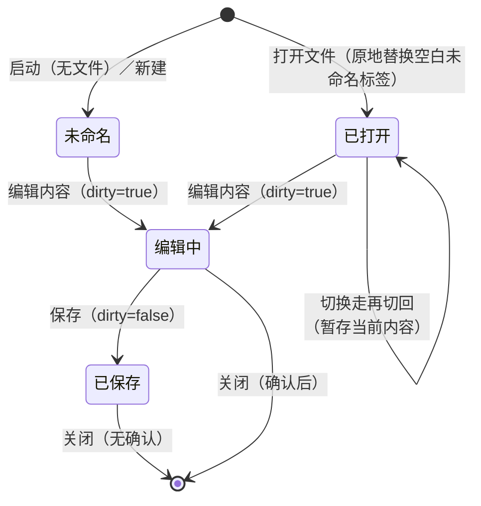
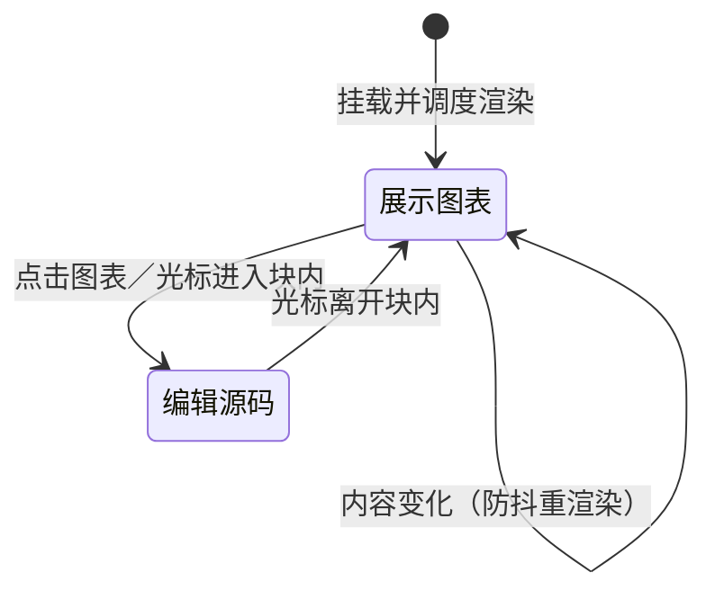
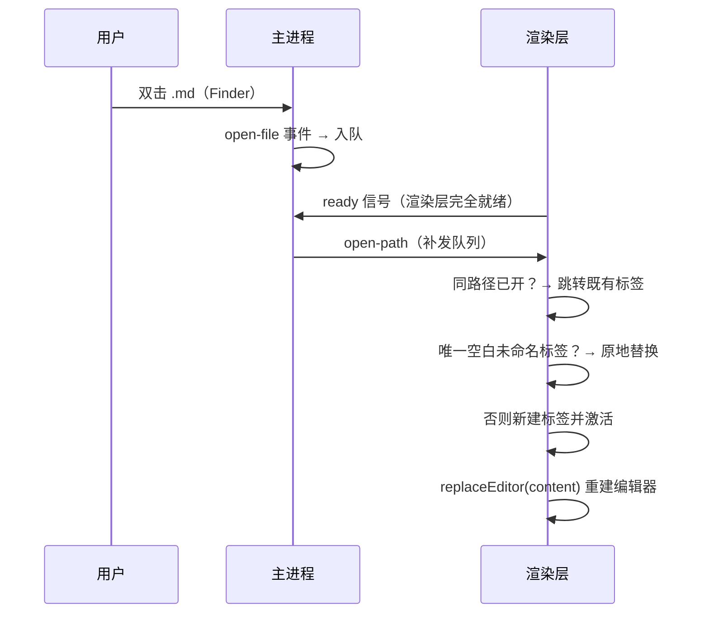
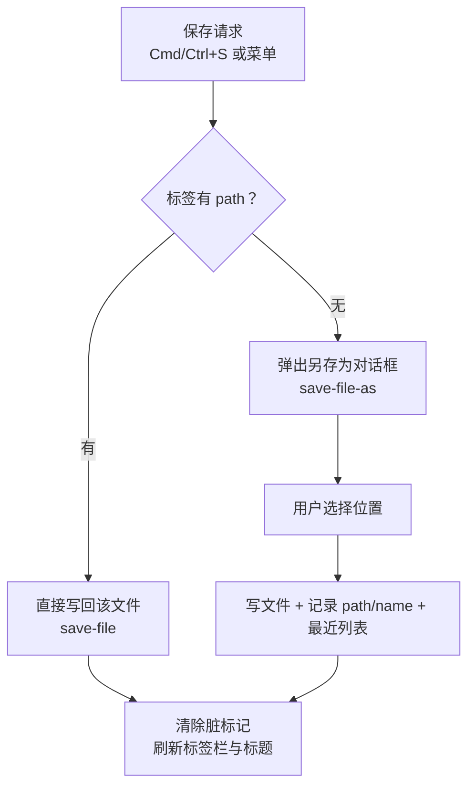
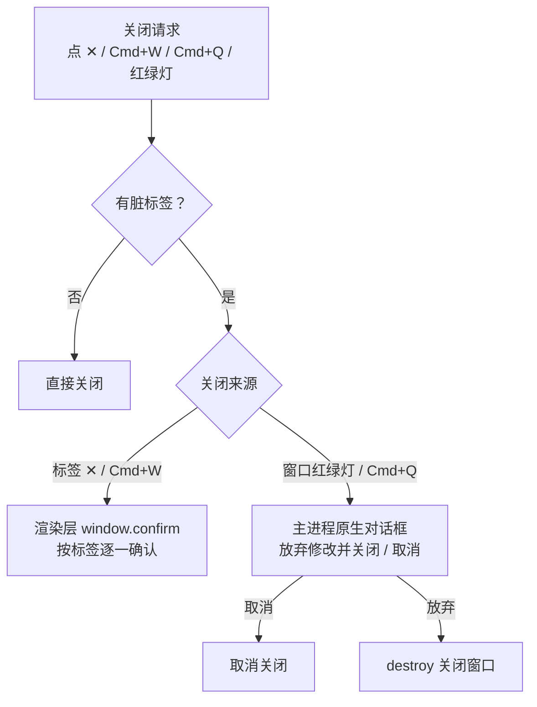

# TMD 详细设计

> 版本：2.0　作者：chiangyang　更新：2026-09-19
> 前置阅读：[架构设计](架构设计.md)。本文描述各模块的内部设计、关键算法与数据结构。

## 1. 数据结构

### 1.1 标签页 DocTab（src/tabs.ts）

应用的核心状态：一个标签对应一份在编辑的文档。

```typescript
interface DocTab {
  id: string          // 自增 id：tab-1, tab-2, ...
  path?: string       // 关联磁盘文件的绝对路径；未保存过的新文档为 undefined
  name: string        // 展示名（文件名或"未命名.md"）
  markdown: string    // 打开/保存时的基准内容（最后一次与磁盘同步的内容）
  dirty: boolean      // 未保存修改标记（由编辑事件置位，保存/打开时清除）
  recovered?: boolean // 启动时从恢复副本还原的内容，不可被"打开文件"原地替换
  scrollTop?: number  // 切走时的滚动位置（切换回来时恢复）
}
```

**脏标记原则**：`dirty` 只由 milkdown 的 `markdownUpdated` 事件（真实编辑）置位，由保存/打开/替换清除。**禁止**用"序列化当前文档与基准比对"的方式判定——序列化会规范化文本（去尾随空格、统一列表标记），未修改的文档也会被判为已修改（此 bug 曾导致关闭空文档误弹确认框）。

### 1.2 语言包（src/locales/*.json）

MarkText 式嵌套键结构，按界面区域分类：

```json
{
  "toolbar": { "outline": "大纲", "find": "查找", ... },
  "menu":    { "file": "文件", "open": "打开…", ... },
  "dialog":  { "closeConfirm": "「{name}」有未保存的修改，确定关闭吗？" }
}
```

- 取词：`t('dialog.closeConfirm', { name })`，`{xxx}` 为参数占位
- 现有语言包：`zh-CN` / `zh-Hant` / `en`，三份键集与键序完全一致（214 键）
- 新增语言 = 加 `src/locales/xx.json` + 在 `i18n.ts` 的 `messages` 注册 + 在设置面板加一个 `input[name="set-lang"]` 单选（三处，缺一不生效）；漏键不会报错，而是直接显示键路径本身，故新增文案须三份同步
- Electron 菜单文案由渲染层 `menuLabels()` 导出、经 IPC 交主进程重建（渲染层是语言的唯一事实源）

## 2. 标签页模块（src/tabs.ts）

### 2.1 状态机



### 2.2 关键规则

| 规则 | 设计 |
|---|---|
| 命名去重 | 未命名.md → 未命名-1.md → 未命名-2.md；在已打开标签中查重，词干随语言包 |
| 打开同路径文件 | 跳转到既有标签，不重复开 |
| 打开文件替换空标签 | 替换任意"空白新建标签"（无路径、未脏、内容为空、**非恢复内容**），避免残留；启动恢复出的未保存内容带 recovered 标记，不会被覆盖 |
| 关闭最后标签 | Electron：关闭窗口（应用留后台，Dock 重开）；浏览器：退回新建空白页 |
| 关闭确认 | `tab.dirty` 为真时弹确认（渲染层确认框用于标签；窗口级关闭走主进程原生对话框） |
| 切换标签 | 旧标签暂存 `currentMarkdown()`，重建编辑器载入目标内容（Mermaid 随之重渲染） |
| 恢复副本生命周期 | 编辑即写 localStorage（崩溃兜底）；保存成功且无其他脏标签时清除；干净退出时清除——已保存的内容不会在下次启动"复活"为未命名标签 |

## 3. Mermaid 实时渲染（src/mermaid.ts）

### 3.1 渲染管线


### 3.2 节点视图状态



### 3.3 关键算法

**防抖 + 序号守卫**：每次渲染请求 `++renderSeq`；异步 `mermaid.render` 返回后若 `seq !== renderSeq` 说明已有更新请求，直接丢弃过期结果——连续快速输入不会闪旧图，也不会错写容器。

**错误兜底**：`mermaid.render` 抛异常时**清空 renderArea**（不保留旧 SVG）并显示具体错误信息（与 Typora/Obsidian 行为一致，避免用户误以为旧图是当前语法的渲染结果）；语法改对后自动恢复。冷启动时 mermaid 的图表类型模块按需懒加载，首次渲染可能抛 "No diagram type detected"，按 400/800/1200ms 自动重试至多三次。

**编辑态判定**：编辑态由"光标选区是否落在节点内容范围内"驱动，选区变化通过一个全量装饰器插件感知（ProseMirror 会在装饰变化时回调节点视图的 `update`），视图据此切换"显示图表 / 显示源码"两类 DOM 的可见性。

**输入规则**：`/^```mermaid$/` 命中后删除触发文本并将所在段落 `setBlockType` 为 mermaid 节点，光标自然落在空节点内进入编辑态。

## 4. 文件打开 / 保存流程

### 4.1 打开文件时序



> `ready` 信号是关键设计：渲染层完全装配完成后才接收打开请求，消除"启动"与"文件打开"的时序竞态（此前会产生两个编辑器实例）。
>
> **无窗口兜底**：应用留后台（窗口已全部关闭）时双击 .md，主进程检测到无窗口（或窗口已销毁）会自动 `createWindow()` 重建窗口承载文件，并 `app.focus({ steal: true })` 带到前台——不再依赖用户点 Dock 触发 activate 才补发。**preload 缓冲**：`open-path` 消息可能早于渲染层注册处理器到达（did-finish-load 早于 boot 装配完成），preload 先缓冲、注册后再补发，消息不丢失。

### 4.2 保存流程



浏览器降级：无 path 时直接触发 .md 下载。

### 4.3 文件侧边栏：最近列表与多文件夹工作区（src/files.ts + filetree.ts + store.ts）

侧边栏文件面板分两段，均由 `renderFilesSidebar()` 统一渲染，数据源不同：

**最近打开**：`tmd:recent`（store.ts，最多 8 条，最新在前），打开/另存文件时 `pushRecent` 去重置顶。行 hover 出现 × 单条移除（`removeRecentDocument`，同步主进程镜像与系统最近文档）；副标题旁「清空」按钮仅在列表非空时显示，`window.confirm` 二次确认后 `clearRecentDocuments` 一次清掉 localStorage、系统最近文档（Jump List/Dock）与主进程菜单（浏览器降级环境无原生菜单，该按钮是唯一清空入口）。

**文件夹（多根工作区）**：数据分两层——

- **持久化引用层**：`tmd:folders`（store.ts，`{name, path}[]`，只存路径不存树）。点「＋文件夹」是**追加去重**而非替换，可同时挂载多个文件夹；重启后引用自动恢复。
- **内存态层**（files.ts）：`folderChildrenCache`（路径 → 目录树数据）+ `expandedFolders`（展开路径集合）。重启后全部保持折叠，首次点 ▸/▾ 展开才经 `readDir` 懒加载并缓存；路径失效（文件夹被移动/删除）toast 提示且不展开。
- **排序**：目录树由主进程 `readDir` 排序（目录在前、文件在后，各自按文件名）；文件名排序区域随界面语言变化——见第 9 节的 `COLLATION_LOCALE`。切换语言后已加载的树由 `reloadFolderTrees()` 重新读盘，避免缓存里留着旧序。

× 单条移除与「清空」（同样二次确认）**只移除侧边栏引用与内存缓存，绝不删除磁盘文件**——按钮 title 与确认弹窗文案均明确说明。filetree.ts 的 `renderFolders` 负责多根行（箭头 + hover × + 展开子树 + 空态），快速切换面板（第 17 节）枚举所有已加载树。

### 4.4 扩展行内语法与 front matter（src/mark-ext.ts + src/frontmatter.ts）

**高亮 / 上标 / 下标（mark-ext.ts）**：

- 语法：`==高亮==`；上标 `x^2^` / `x^{2}`；下标 `H~2~O` / `H_{2}O`。两种写法均解析，序列化统一 Pandoc 单符号风格
- 解析：`$remark` transform 只切分 mdast **text 节点**（行内代码 / 公式 / 链接 URL 非文本子节点，天然免疫误切）；切分顺序 花括号 → 单 `^` → 单 `~` → `==`，奇数分隔符不配对、空内容不产生节点；单 `^`/`~` 内容禁空白（降低口语化误配），`==` 允许空格但不允许内含 `=`
- remark-gfm 默认 `singleTilde` 会把 `~x~` 在词法层解析成 delete：transform 按节点 position 回溯源码定界符，把「单波浪且内容无空白」的 delete 纠正为 subscript，`~~双波浪~~` 保持删除线
- 序列化：经 `this.data('toMarkdownExtensions')` 注入 handlers（与 remark-gfm 同机制），`containerPhrasing` 包裹子内容输出 `==` / `^` / `~` 定界符
- schema：三个容器型 mark（parseDOM 接 `<mark>`/`<sup>`/`<sub>`，粘贴 HTML 自动识别）；输入规则 markRule 即时成标，带**未闭合围栏守卫**——匹配点前方未转义反引号 / `$` 为奇数个时抑制成标（否则 `` `m^2^` ``、`$a^{b}$` 输入过程中分隔符先被吃掉，闭合围栏时内容无法还原）。取舍：同段存在单个 `$` 的货币文案（售价 $5，x^2^）也被保守抑制，写 `\$` 规避；`inUnclosedSpan` 为导出纯函数（单测覆盖）

**脚注（mark-ext.ts 补 gfm preset 缺失的输入路径）**：

- gfm preset 只提供 schema（`footnote_reference` 行内原子 + `footnote_definition` 块 dl/dt/dd）、remark 解析与双向序列化，**不含输入规则**——手打 `[^1]` 不会转换，本模块补齐
- 引用规则 `footnoteRefInputRule`：行内输入 `[^label]` 的 `]` 瞬间把文本替换为 footnote_reference 原子节点（`FOOTNOTE_REF_RE`），同样套未闭合围栏守卫
- 定义规则 `footnoteDefInputRule`：新行输入 `[^label]: `（尾随空格触发，`FOOTNOTE_DEF_RE = /^(\ufffc|\[\^([^\s\]]+)\]):\s$/`）。须兼容两种形态——正常输入流里引用已是原子节点，InputRule 的 textBefore 以 ``（U+FFFC）占位，label 取节点 attrs；字面形态（粘贴后补冒号）label 取正则分组。守卫：匹配必须从段落内容起点开始（`parentOffset === 0`，防长段落中 `^` 锚失效误转）且光标在段尾
- 替换范围必须是**整个段落节点**（`$start.before()` → `$start.after()`）：初版从内容起点替换会切开段落、左侧残留空壳，序列化多出 `<br />`；转换后显式把光标送进 dd 内空段落
- 退出键位 `footnoteDefExit`（`$prose(keymap)`）：commonmark 的 Enter 只绑在 list_item 内、dl 内不命中，默认分段会把后续内容困进脚注体（序列化缩进 4 空格）。光标在定义块**最后一个子块段尾**按 Enter → dl 之后插入正文段落并移光标（Typora 同款）；非段尾返回 false 走默认分段，保留脚注体多段落。末位判断用「`def.lastChild === 当前块` 且 parentOffset 段尾」，不能用 `after(d)-1`（那是 dl 闭合 token 位，与光标差一个子块 token）

**YAML front matter（frontmatter.ts）**：

- 解析：attacher 内复用 `remark-frontmatter` 官方扩展注册三套 micromark/mdast 扩展，transform 把 yaml 节点替换为自定义 frontmatter 字面节点，value 存**围栏原文**——从源码按 position 切片到下一兄弟节点起点前（保留围栏与正文间的原始空行），末尾仅去一个 LF 保留 CR，序列化时 join 补回恰好复原 LF/CRLF
- 序列化：handler 原样输出 value；join 规则对 frontmatter 后邻块返回 0（不额外加空行，间隔已含在切片里），实现**字节级往返**。仅文档开头的围栏是 front matter，正文中间 `---` 仍是分隔线
- schema：原子块（group:block/atom/defining），attrs.value 存原文；`fresh` attr 仅输入规则创建时为 true——不能用「value 等于空围栏」判别新建（空内容提交后会再次误入编辑态）
- NodeView 双态：属性表（平铺 `key: value`，列表 / 多行 / 嵌套值显示「复杂值」占位，点击属性区或「编辑」按钮进编辑）↔ YAML textarea（Cmd/Ctrl+Enter 提交、Esc 取消、Tab 插入两空格）；非法 YAML（首行非 `---` 或缺少闭合行）红色提示并停留编辑态，原文不动
- 输入规则：文档首个空段落逐字输入 `---` 即创建块并进入编辑态。**注册顺序关键**：输入规则插件必须先于 commonmark 注册（抢在水平线规则前，InputRule 按注册顺序首个生效），但 schema/remark/view 不能跟着提前——frontmatter 是 block 节点，先于 paragraph 注册会被空文档自动补块（fillBefore）误选为第一个块

## 5. 查找替换（src/find.ts）

- 匹配：在所有文本节点内做大小写不敏感查找，逐节点收集 `{from, to}` 区间（不跨节点匹配）
- 高亮：ProseMirror 插件的 `decorations` 属性按匹配区间生成内联装饰（普通命中 / 当前命中两种样式）；查询变化后派发一个仅带 meta 的空事务触发装饰重算
- 跳转：`index ± 1` 循环取模，`TextSelection` 定位并 `scrollIntoView`
- 替换单个：`tr.insertText(替换词, from, to)` 后重新收集匹配
- 全部替换：按 `from` **从后往前**依次 insertText（避免位置偏移），单事务一次完成
- 源码模式：不启用本模块，使用 CodeMirror 自带搜索面板

## 6. 源码模式（src/sourcemode.ts）

- 进入：取当前 markdown 全文 → 销毁所见即所得编辑器 → 在 `#src-editor` 挂载 CodeMirror（basicSetup + markdown 语法）
- 退出：取 CodeMirror 全文 → 重建所见即所得编辑器（mermaid 等随内容重新渲染）
- 快捷键 Cmd/Ctrl+E；查找交给 CodeMirror 内建搜索面板（`⌘F` 不拦截）

## 7. 导出（src/export.ts + src/export-doc.ts / export-word.ts / export-image.ts + electron/exporter.cjs）

四种载体（独立 HTML / PDF / Word / 长图）共用同一条渲染管线与同一份导出样式，杜绝多份版式定义漂移。

**共享文档核心（src/export-doc.ts）**：与载体无关的中间表示，不依赖 Electron、除变量采集外不碰 DOM 副作用，纯函数部分可在 node 环境直接单测。

- `renderMarkdown`：markdown-it 渲染（`html:false` 防 XSS；mermaid 围栏转 `<pre class="mermaid">`；TOC 标记行删除、标题 slug 锚点、front matter 剥离）；接入 footnote / mark / sub / sup 四个插件
- **公式保护内联规则（`tmd_math`）**：注册在 `text` 规则之前，把 `$$…$$` / `$…$` 整段按原文保留为单个文本 token。否则 LaTeX 原文会被其他内联规则二次解释——转义规则把 `\,` 吞成 `,`、上下标插件把 `x^{2}` 变成 `x<sup>{2}</sup>`——公式在三条导出路径上同时失真。判定与常见编辑器一致：`$$` 允许跨行、`$` 不跨行且内容首尾无空白（避免把「价格 $5 与 $6」误判为公式）
- `buildExportDocument`：Markdown + 主题变量快照 + 样式表 + 语言/深浅 → `ExportDocument`，三种载体各自消费
- `resolveExportImageRef`：图片引用分类纯函数（`embedded` 已内嵌 / `remote` 远程 / `local` 本地待读盘 / `blocked` 危险协议或无法定位），离屏页据此决定是否需要主进程读盘
- `convertImgTokens` + 图片渲染规则：`html:false` 下 `` 会被转义成文本，渲染前还原为真实 image token（保留 width/align 属性）

**HTML**：`buildExportDocument` 产物套上 CDN 外壳（mermaid/KaTeX 在线渲染），样式内联，Electron 走 `export-as` 保存对话框、浏览器降级为下载。

**PDF**：Electron 下 `webContents.print`（系统打印对话框可选"存储为 PDF"）；浏览器下 `window.print()`。打印的是编辑器现成 DOM，目录直接可见。

**Word / 长图（v1.3 离屏导出）**：两者都需要"已渲染的结果"（Mermaid 是动态渲染的 SVG、KaTeX 是运行时生成的 span 树），故引入独立离屏渲染服务。

- **离屏服务（electron/exporter.cjs）**：`show:false` 的 BrowserWindow 单例（跨任务复用，省去重复加载 mermaid/katex），串行任务队列（导出低频，同一时刻一个任务），独立内存分区 `tmd-exporter`（`session.fromPartition` 不加 `persist:` 前缀，退出即清）并单独注入放宽图片/字体来源的 CSP（主窗口默认分区 CSP 不放行远程图片），导航与 `window.open` 一律拒绝，`enableLargerThanScreen` + `useContentSize` 允许视口高于屏幕，`backgroundThrottling:false` 保证隐藏时仍按帧渲染。Electron 能力由 main.cjs 依赖注入而非顶层 `require('electron')`，故纯校验函数（`fileUrlToPath` / `imageMimeOf` / `readImageAsDataUri`）可在 node 环境直接单测
- **分工（命令模式）**：主进程只提供 Electron 独有原语——保存对话框 + 结果落盘、设置视口尺寸或截取视口区域（`capturePage`）、本地图片白名单读盘转 data URI（仅绝对路径 + 图片扩展名，32MB 上限）；Markdown 注入、mermaid/katex 渲染、分段、拼接、OOXML 转换等编排全在离屏页 TypeScript 侧（可被 vitest 覆盖），主进程保持薄壳
- **离屏页（export-renderer.html + src/export-renderer.ts）**：结构与独立 HTML 导出完全一致（正文即 body 内容、样式表注进 `<head>`），按 `task.kind` 分派两种处理器（策略模式），共用管线为「注入文档 → 图片本地化 → KaTeX 自动渲染 → 字体就绪 → Mermaid 渲染 → 分派」。模块脚本置于 `<head>`（默认 defer），使 body 可被正文整体替换
- **图片本地化**：相对路径图片在离屏页不可见（无 file: 读取权限），按 `resolveExportImageRef` 分类后经主进程读成 data URI 内联；远程图片由离屏页按自身 CSP 直接 `fetch`（转换器的 `imageResolver` 仅兜底这一类），主进程不参与网络访问
- **Word（src/export-word.ts）**：`dom-docx` 浏览器入口 + `styleSource:'computed'`（直接从 live DOM 读计算样式，导出版式在样式表与 CSS 变量里，无需自写"样式内联层"）。**复杂视觉块统一用真实合成器区域截帧栅格化**再替换元素——独占公式 `.katex-display`（KaTeX span 树转文本必走形）与 `pre.mermaid`（其 SVG 含 foreignObject，交给转换器的 canvas 栅格化会因画布污染抛错；自绘 foreignObject 又取不到网页字体）；截帧前需 `scrollIntoView` 且元素完整落在视口内，失败即保留原 DOM 降级。转换器选项：`pageSize:'a4'`（中文文档惯例）、`lang` 取当前界面语言、`rasterizeInPlace:false`、`onWarning` 收集降级告警。转换器本体藏在单一函数之后，替换引擎只需改本文件
- **长图（src/export-image.ts）**：先按显示像素比做清晰度归一（`zoom = max(1, 2/dpr)`，使 `zoom × dpr ≥ 2`，Retina 上不缩放、1x 屏放大到 2x），再按 Chromium 单帧纹理上限分段截图（单段物理高 ≤ 8000），最后在离屏页 canvas 纵向拼接为 PNG。分段偏移按「上一段实际捕获到的高度」推进而非计划步长（窗口管理器若钳制视口高度仍能无缝续接），画布宽度取首段实测值并预填页面背景色。整图物理高上限 120000px（约 60000 原始 CSS px），超限拒绝并提示
- **入口与反馈**：主菜单「导出」区新增两项、工具栏 ⋯ 菜单同步（两者均**不绑快捷键**，避免误触重任务；较慢的离屏导出只走显式入口），渲染层 `exportWord` / `exportLongimage` 采集当前主题变量快照与文档目录后交给 `export-run`。取消保存对话框时不启动离屏渲染；转换失败 toast 提示；成功不打扰（与 HTML/PDF 保存反馈一致）。浏览器环境（无 native）两项入口隐藏
- **打包体积**：`dom-docx` 仅在离屏页入口引用，构建后独立分包，主窗口不加载

## 8. 粘贴图片（src/paste-image.ts）

ProseMirror `handlePaste`：检测剪贴板中的图片文件 → 单张 > 5MB 忽略并告警 → 按设置面板配置的存储策略插入 image 节点：

- **inline（默认）**：FileReader 转 data URL 内联进文档，不要求文档已保存
- **assets**：经 IPC `save-image` 写入文档同目录 `assets/` 文件夹，文档中保存相对路径（`assets/xxx.png`，便于迁移与 GitHub 展示）；要求文档已保存过，未落盘或写入失败时自动降级 inline
- **图床（hosting）**：渲染层把 base64 经 IPC `upload-image` 交给主进程——PicGo 需 Node 运行时，故上传统一在主进程完成（写临时文件 → PicGo-Core 上传 → 删除临时文件），文档中写入返回的云端 URL。内置 SM.MS / GitHub / 七牛云 / 又拍云 / 腾讯云 COS / 阿里云 OSS / Imgur 共 7 种，配置存 `userData/picgo-config.json`（随卸载清理，不污染用户 home 下的 PicGo 配置）；未配置或上传失败时自动降级 inline

三策略共同兜底：任何一步失败都退回 inline，保证粘贴动作不产生内容丢失。相对路径的"显示解析"由 src/image-resolver.ts 负责：文档内容里始终保存相对路径，打开/切换标签时按文档所在目录解析为可显示的 src。

## 9. 多语言（src/i18n.ts）

- 语言检测顺序：localStorage 覆盖 → 系统语言（`zh-TW` / `zh-HK` / `zh-MO` / `zh-Hant` → zh-Hant，其余 `zh*` → zh-CN，其他 → en）
- 繁中按台港用词翻译，不是简单繁化：文件→檔案、文档→文件、设置→設定、保存→儲存、标签页→分頁、查找→尋找、替换→取代、导出→匯出、快捷键→快速鍵、代码→程式碼；其中**「行/列」语义整体平移**——简中的「行（row）/ 列（column）」在繁中是「列 / 欄」，表格工具栏按钮随之从「行+/列+」变为「列+/欄+」
- 三类替换：`t(path, params)` 动态取词；`data-i18n` / `data-i18n-title` / `data-i18n-placeholder` 静态 DOM 批量替换；`menuLabels()` 导出菜单文案交主进程重建菜单
- 切换语言时同步六处：静态文案、`<html lang>`（同一字体下的简/繁字形选择、断行与屏幕阅读器发音都据此判定，index.html 的静态 `lang="zh-CN"` 会被纠正）、标签栏、标题与字数、主进程菜单文案与文件树排序
- 导出 HTML 的 `<html lang>` 同样取当前语言，保证导出页用对字形
- 菜单重建时保留自动保存勾选状态（主进程持有）
- 语言码同时驱动主进程行为：`setLocaleInfo` 携带 `{ labels, locale }`，`labels` 用于重建菜单，`locale` 经 `COLLATION_LOCALE` 映射为 Intl 排序区域（zh-CN → zh-CN 拼音序、zh-Hant → zh-TW 笔画/部首序、en → en），供 `readDir` 排序文件树；未收到同步前用 `app.getLocale()` 兜底。**繁中必须映射到 `zh-TW`**——`zh-Hant` 不在 ICU 的排序区域表里，直接用它只会退回默认中文序
- 切换语言后，已加载的文件夹树由 `files.ts` 的 `reloadFolderTrees()` 重新读盘（缓存里是旧序）；未加载的条目本就在首次展开时读取，无需处理

**验证**（CDP 驱动真实应用，隔离 userData）：同一目录内四个中文文件名，简中得 `陈六 李四 王五 张三`（拼音序），切繁中后无需重启即变为 `王五 张三 李四 陈六`（笔画/部首序，与 ICU zh-TW 规则一致），两序文件集合相同。

## 10. 关闭保护链路



> 标签级确认必须用渲染层 confirm；窗口级关闭确认必须用主进程原生对话框——渲染层 confirm 在 Electron 关闭流程中会静默失效（历史 bug：导致窗口无法关闭）。

## 11. 目录块（src/toc.ts）

**存储格式**：目录在 Markdown 中存为 HTML 注释包裹的真实链接列表（注释与列表间留空行），外部渲染器（GitHub / VS Code）中注释不可见、链接可见可点：

```markdown
<!-- TOC -->

- [标题一](#标题一)
  - [子标题](#子标题)

<!-- /TOC -->
```

**设计要点**：

| 环节 | 设计 |
|---|---|
| remark 解析 | Milkdown 的 remark-parse 关闭原始 HTML（`allowDangerousHtml: false` 安全默认），`<!-- TOC -->` 在 mdast 中是**内容为注释文本的段落**而非 html 节点；转换递归遍历，对 html / paragraph 节点取纯文本后按正则识别开闭标记，开标记前若混有其他正文则跳过；开闭标记之间的列表等节点整体合并为一个原子 `toc` 节点，闭标记缺失时容错吞到容器末尾 |
| 序列化 | `toc` 节点输出两个含注释文本的**段落**（不能输出 html mdast 节点——序列化器同样关闭危险 HTML）；`currentMarkdown()` 再经 `fillTocBlocks()` 用正则把占位区间替换为「开注释 + 空行 + 真实链接列表 + 空行 + 闭注释」，源码模式、保存、导出拿到的都是完整文本 |
| 转义兼容 | remark-stringify 会把行首 `<!` 转义为 `\<`（防 HTML 注入），填充与导出清理的正则均以 `\\?` 兼容可选前导反斜杠，避免文件中残留可见的 `\` |
| 节点视图 | 原子块（`atom: true`），光标不进入；方向键导航到块上产生 NodeSelection 后 Backspace 删除（`stopEvent()` 拦截块内点击事件，不转为块选中）；实例登记在模块级 Set，由 prose 插件在 `docChanged` 时统一 `refresh()` 重建列表（toc 节点自身不随标题变化，`update()` 不触发刷新） |
| 目录渲染 | 收集 1-3 级标题按层级缩进；无标题时显示空态提示；点击条目用 `TextSelection.near` 定位到对应标题并 `scrollIntoView()`（与大纲面板同一定位方式） |
| 锚点规则 | `slugify()` 为 GitHub 风格（小写、空白转连字符、去标点、保留中文）；同名标题按出现顺序加 `-1`/`-2` 后缀；链接文本中的 `\`、`[`、`]` 做转义。编辑器填充链接与导出 HTML 给标题加 id 共用同一规则，保证锚点一致 |
| 插入入口 | ① ⋯ 菜单「插入目录」（`insertToc(view)`：顶层段落整段替换，其他位置拆分段落插入）；② 输入规则：空行输入 `[TOC]` 回车自动转为目录块（仅顶层段落生效，列表项 / 引用内不触发） |
| 导出 HTML | markdown-it 以 `html:false` 渲染，注释会被转义成可见文本，故渲染前按行删除 TOC 标记行（保留中间链接列表正常渲染）；`heading_open` 规则为所有标题生成同规则 id 锚点。PDF 走编辑器现成 DOM，目录直接可见 |

## 12. 主题预设、文件式主题与自定义 CSS（src/theme-presets.ts + electron/themes.cjs）

主题体系分四层，全部落在 CSS 层，互不触碰编辑器实例：`style.css` 内建配色（基础）→ 主题预设（变量覆盖）→ 文件式主题（用户自制 CSS 原样注入）→ 自定义 CSS（最高优先级，可引用前三层定义的任意变量）。

**主题预设**：`THEME_PRESETS` 定义四项——简约白（default，空覆盖）、深色（dark，即 html.dark 内建变量，选择它等于切深色模式）、羊皮纸（sepia）、护眼绿（green）。每个非空预设由 `presetCss()` 模板生成深浅两套变量覆盖：浅色限定 `html[data-theme-preset]:not(.dark)`，深色限定 `html[data-theme-preset].dark`——保证深浅模式各自正确覆盖且不串扰。

**注入方式**：预设写入 `<style id="theme-preset-style">`，自定义 CSS 写入 `<style id="custom-css-style">`（位于预设之后，同优先级下可覆盖预设）；变更即时生效，持久化经 store 的 `tmd:theme-preset` / `tmd:custom-css` 键，启动时 `restoreThemeStyles()` 恢复。

**设置面板统一主题列表**：原「主题外观」（深浅）与「主题预设」两栏合并为一个列表，映射规则——default+浅色 → 简约白；default+深色 → 深色；sepia/green → 各自预设项。选中深色项调用 `applyTheme(true)`，其余预设按各自浅色外观应用（当前为深色则切回浅色）。弹窗结构上标题栏与关闭按钮 `position: sticky` 吸顶，长内容滚动时保持可见。

**文件式主题（v1.3）**：主题目录固定 `~/.tmd/themes`（`app.getPath('home')` 下，跨安装/升级保留——主题是用户资产，不同于随卸载清理的 userData 配置），只扫一层 `*.css`；文件名去扩展名即主题显示名（支持中文，天然免 i18n）。主进程 `electron/themes.cjs` 是不依赖 Electron 的纯 Node 模块（与 search.cjs 同构）：`isThemeFileName` 过滤（非隐藏、单层、`.css` 大小写不敏感）、`safeThemeName` basename 校验（拒绝分隔符/`..`/非字符串）+ `readThemeFile` 中 join 后目录归属二次防线，1MB 大小兜底。三条 IPC：`themes-list`（目录不存在返回空列表，**不**凭空创建）、`themes-read`、`themes-open-dir`（`mkdir -p` 后 `shell.openPath`；目录中一个 `.css` 都没有时写入「示例主题.css」模板——列出全部 11 个变量的浅色/深色两块，已有任何 .css 则不写以尊重用户清场）。

文件 CSS 注入 `<style id="theme-file-style">`，创建时显式插在 custom-css-style 之前以保证优先级链。文件主题与内置预设**互斥**：选中即预设层回落 default（移除 `data-theme-preset`），但**不联动深浅模式**（文件作者自行用 `html.dark` 适配，mermaid 主题仍跟随当前深浅）。持久化经 store 新增 `tmd:theme-file` 键存裸文件名；boot 时在 `restoreThemeStyles()` 之后 `await restoreFileTheme(onMissing)`——异步 IPC 赶在编辑器挂载前完成以防首屏闪内置配色；文件已被删除则清持久化、回落内建变量并 toast。

设置面板主题区在内置四项 radio 之后动态渲染文件项（radio 值为 `file:` 前缀 + 文件名），高亮统一由纯函数 `resolveThemeSelection(isDark, preset, fileName)` 计算（单测覆盖），文件名经 `textContent` 赋值不经 HTML 解析。交互上**不做常驻 fs.watch**：「打开主题文件夹」「刷新」为显式入口——外部编辑器改完 CSS 保存后点刷新即重载（当前主题内容热替换）；当前主题文件已被删则撤出注入层并 toast；切界面语言后重扫一次（主进程排序区域随语言变化）。浏览器环境（无 native）整个文件主题区隐藏。导出零改动：export.ts 抓计算后变量快照，文件主题自动跟随；文件中的直接选择器样式不进导出（与自定义 CSS 行为一致）。

## 13. 拖拽打开文件（src/dragdrop.ts）

拖 .md 文件进窗口即打开（新标签），拖图片进文档按粘贴图片策略插入，两者混合拖入各自处理。

**事件设计**：监听挂 window **捕获阶段**，且只拦截 `dataTransfer.types` 含 `Files` 的拖放——`dragover` preventDefault 是 drop 能发生的前提；`drop` preventDefault + stopPropagation 阻止 Chromium 用文件触发页面导航。不含文件的拖放（编辑器内部文本拖拽重排）不拦截，交回 ProseMirror 默认处理。主进程另有 `will-navigate` 一律 preventDefault 兜底（单页应用无合法导航）。

**文件处理**：

| 类型 | Electron | 浏览器 |
|---|---|---|
| .md / .markdown | `webUtils.getPathForFile(file)` 换绝对路径 → `openPath()` 磁盘读取（享受同路径去重与最近列表） | `file.text()` 读内容 → `openFromData()`（无路径，不去重） |
| image/* | 所见即所得模式下 `insertImageFiles()` 按粘贴策略插入（inline / assets / 图床，与粘贴共用同一实现）；源码模式无 ProseMirror 视图，忽略 | 同左 |

> Electron 32+ 移除了 `File.path` 属性，绝对路径必须经 preload 的 `webUtils.getPathForFile()`（同步、无需 IPC）解析，经 native 契约暴露为 `getPathForFile`。

## 14. 格式化命令层与快捷键（src/format.ts / src/shortcuts.ts）

快捷键与主菜单「格式」栏共用同一批 ProseMirror 命令（标准事务，可撤销），菜单项通过既有 `tmd:menu` IPC 通道以 `fmt-*` action 下发，与文件/导出菜单同一分发路径。

**快捷键配置源（src/shortcuts.ts）**：全部 31 项快捷键（文件 7 / 导出 2 / 格式 17 / 编辑器 5）集中定义在 `SHORTCUT_DEFS`，每项含 action、显示名 i18n 路径、默认 accelerator、分组。配置以渲染层 localStorage 为权威，主进程经 `tmd:sync-shortcuts` 单向接收后重建菜单 accelerator；编辑器侧 `handleKeyDown` 每次按键实时读同一份配置。因此改键后三处（主进程菜单 / 所见即所得编辑器 / 全局 keydown）同时生效，无需重启或重建编辑器。

设置面板提供按键捕获（capture 阶段拦截 keydown）、合法性校验（必须含 Ctrl/Cmd 或 Alt——仅 Shift 会与大写字母输入冲突）、冲突检测（与已配置项比对，冲突时拒绝写入并在该行内就地提示）、一键恢复默认。显示文本按平台惯例格式化：Windows 用加号连接显示 `Ctrl+Shift+O`，macOS 按苹果 HIG 的 ⌃⌥⇧⌘ 顺序显示 `⇧⌘O`（与系统菜单栏一致）。

**命令清单与默认快捷键**：

| 命令 | 默认快捷键 | 实现 |
|---|---|---|
| 加粗 / 斜体 | Ctrl/Cmd+B、I | `toggleMark` |
| 删除线 / 行内代码 | 无（仅菜单） | `toggleMark` |
| 链接 | Ctrl/Cmd+K | 见下文链接切换 |
| 标题 1~6 / 正文 | Ctrl/Cmd+1~6、0 | `setBlockType`（引用/列表内同样生效） |
| 引用 | Ctrl+Q（macOS 同为 Ctrl+Q——Cmd+Q 是退出应用） | 切换：引用内 `lift` 退出，否则 `wrapIn` |
| 代码块 | Ctrl/Cmd+Shift+K | `setBlockType(code_block)` |
| 无序 / 有序列表 | Ctrl/Cmd+Shift+8、9 | 切换：任何列表内 `liftListItem` 退出当前项，否则 `wrapInList` |
| 高亮 / 上标 / 下标 | Ctrl/Cmd+Shift+H、+Shift+=、+Shift+- | `toggleMark`（对应 `==高亮==` / `^上标^` / `~下标~`，语法见 §4.4） |

> 上表为默认值，用户可在设置面板改键；改后菜单与编辑器同步生效。

**双路径互斥**：Electron 下菜单 accelerator 先消费按键（渲染层收不到 keydown），编辑器侧快捷键不会重复触发；浏览器模式无菜单栏，编辑器侧是唯一路径。源码模式（CodeMirror）不挂 ProseMirror 编辑器，keymap 自然失效，菜单路径由 main.ts 以 `isSourceMode()` 显式拦截。两条路径读同一份 `SHORTCUT_DEFS` 配置，改键后行为一致。

**keymap 实现**：不使用 ProseMirror 的 `keymap({...})` 静态注册——静态注册在改键后旧键仍会生效。改用自定义 Plugin 的 `handleKeyDown`：每次按键把事件转为 accelerator 与配置比对，命中则调 `applyFormatAction` 并消费事件。副作用是配置改动立即生效，无需重建编辑器实例。

**链接切换（Ctrl+K）**：选区已带链接 → `toggleMark` 移除；无链接且有选区 → 打开链接栏（复用查找栏样式，`#link-bar`）输入地址，回车/「应用」后先恢复打开时刻暂存的选区再加 `link` 标记（两个事务，均可撤销）；纯光标无选区不动作。链接地址经 Milkdown 内建 sanitize-href 清洗。

**下划线（Ctrl+U）不提供**：Markdown 无下划线语法，要么存 HTML `<u>`（破坏纯文本存储与其他编辑器往返兼容，且 `html:false` 解析不回来），要么丢格式——按「数据格式序列化兼容」原则明确不做。

## 15. 右键上下文菜单（src/context-menu.ts）

编辑区（仅所见即所得模式，源码模式交回浏览器默认菜单）右键弹出，自绘 HTML 菜单复用 ⋯ 溢出菜单的 `.menu-item` 样式——主题 CSS 变量自动跟随深浅色，浏览器模式同样可用。

**显隐规则**（`resolveMenuEntries` 纯函数，单测覆盖）：

| 上下文 | 菜单项 |
|---|---|
| 无选区 | 仅粘贴 |
| 有选区 | 剪切、复制、粘贴 + 内联格式组（加粗/斜体/删除线/行内代码/链接） |
| 选区已带链接 | 「链接…」切换为「移除链接」 |

**剪贴板实现**：菜单项点击后先 `view.focus()`，再 `document.execCommand('cut'/'copy'/'paste')`——Electron 下粘贴产生真实 paste 事件，走 ProseMirror 粘贴管线（HTML/图片/markdown 全保真，粘贴图片三策略自动生效）；浏览器模式 `execCommand('paste')` 被禁用，降级为 `navigator.clipboard.readText()` 插入纯文本（丢富格式，已知限制）。格式化项与链接切换直接调用 format.ts 的 `applyFormatAction` / `toggleLink`，零新增命令逻辑。

**关闭**：点击菜单外任意位置（document 级监听，与 ⋯ 溢出菜单同一模式）、Esc、选中菜单项后自动关闭。

## 16. 链接点击跳转（src/link-nav.ts）

Mod（macOS Cmd / 其他 Ctrl）+点击链接跳转，浏览器模式无壳层 API 自然降级（点击不响应）。

**目标解析**（`resolveLink` 纯函数，单测覆盖）：http/https → 外部；`file://` 与绝对路径 → 本地文件；相对路径按当前文档目录拼接并规范化 `./`/`../` 段（`normalizePath`）；`mailto:`/`tel:`/文内 `#锚点` v1 不处理；相对路径在文档未保存（无基准目录）时返回 null。设置面板「关于」的邮箱链接不走此路径——带 `data-external` 的链接由 settings.ts 直接调 `openExternal` 打开。绝对路径判定兼容 Windows 盘符形式（`E:\` 与 `E:/`），分隔符统一与 `./`、`../` 折叠规则见 §23。

**安全边界**：`openExternal` 在主进程严格校验协议白名单（`new URL(url).protocol` 必须为 http: / https: / mailto:，解析失败一律拒绝），防任意协议经系统打开器注入；本地文件走独立 `openLocalFile` 通道（`shell.openPath`，系统默认应用打开）。

**交互**：ProseMirror `handleClick` 判定 mod+click 并取点击位置的 link 标记 href；按住 Mod 键悬停时编辑区链接显示 pointer + 下划线（window keydown/keyup 切换 `.mod-pressed` 类）提示可点击。

## 17. 快速切换面板（src/quick-switch.ts）

Ctrl/Cmd+P 唤起居中弹窗，按文件名模糊搜索、↑↓ 选择、回车打开；Esc / 点击遮罩关闭。源码模式下同样可用（只操作标签与文件，不触碰编辑器）。

**候选来源**（`collectEntries`，合并按路径去重，全部渲染层既有数据）：已打开标签（标记 `•`，回车跳转既有标签）→ 全部已展开加载的文件夹树（多根工作区，逐棵递归展平，仅文件节点）→ 最近列表（读盘新开，`openPath`）。

**模糊匹配**（`fuzzyScore` 纯函数）：query 字符按顺序出现在目标中即命中（大小写不敏感）；评分词首命中 +16（行首或 `/ - _ . 空格` 之后）、连续命中 +10、其余 +1；`rankEntries` 取文件名得分与全路径得分的最大值（后者打 0.9 折，命中文件名优先），同分按文件名短者、路径字典序排序。已知限制：不做拼音首字母匹配（`jhg` 搜不到「交互稿」，需引入 pinyin 类依赖，留作后续增强）。

**快捷键让位**：Ctrl/Cmd+P 原为「打印 / 导出 PDF」菜单 accelerator，Electron 下会被菜单消费导致渲染层收不到——高频让位高频，PDF 改为 Shift+CmdOrCtrl+P。

## 18. HTML 粘贴转换（src/paste-html.ts）

从网页/Word 复制的富文本（剪贴板 `text/html`）粘贴时自动转为 Markdown 结构，注册在粘贴图片插件之后——剪贴板含图片文件时让位给图片策略，转换失败或内容为空返回 false 交给 ProseMirror 默认纯文本粘贴。

**转换链**：`DOMParser` 解析（inert 文档，脚本不执行）→ 白名单清洗 → prosemirror-model `DOMParser.fromSchema(schema).parseSlice()` 按编辑器 schema 的 parseDOM 规则转换——标题/列表/引用/行内标记/链接/图片/表格的规则全部来自 Milkdown 预设，转换器零自研。

**白名单两层**：

| 层 | 内容 |
|---|---|
| 标签 | REMOVE（script/style/iframe/form/svg 等连子树移除）；UNWRAP（span/div/font/u/上下标及 Word 命名空间 `o:p` 等排版壳剥壳保文本——u/上下标与「无下划线」数据格式原则一致） |
| 属性 | 仅保留 `a[href]`、`img[src,alt]`，style/class/id/onclick 等一律剥除 |

**协议白名单**（纯函数，单测覆盖）：链接仅放行 http/https/mailto 与相对路径（`javascript:`/`data:` 等含协议地址一律拦截，不安全链接降级为纯文本）；图片额外放行 `data:image/`（与粘贴图片内联策略一致）。

**复杂嵌套的预期边界**：网页的多层嵌套表格/悬浮布局转换后结构会变平（Typora 同样如此），目标是常用结构不丢格式而非像素级还原。

## 19. 表格悬浮工具栏（src/table-toolbar.ts）

光标进入表格时在表格上方弹出悬浮栏（行+/行−/列+/列−/左/中/右），点击表格外或光标移出即隐藏（PluginView 随事务更新 + 滚动/resize 重定位）；源码模式无 ProseMirror 编辑器，自然不出现。

**命令层**（全部复用 `@milkdown/prose/tables`，零自研表格逻辑）：加行/加列直接基于光标 selection（`addRowAfter`/`addColumnAfter` 等）；删行/删列与对齐先构造**整行/列的 CellSelection**（`TableMap.cellsInRect` 求该行列全部单元格 → `CellSelection.create` → `state.apply` 落选区）再执行 `deleteRow`/`deleteColumn`/`setCellAttr('alignment')`——选区与操作合并在同一次 dispatch，撤销为单步。删到最后一行/列时 prosemirror-tables 自动删除整个表格。

**行列定位**：`findTableContext` 从选区向上找 `table` 祖先与所在 cell，`TableMap.findCell(相对位置)` 反推行列下标；单元格格子在表内的相对位置 = cellPos − tablePos − 1。

**列宽拖拽**：gfm 预设内置的 `columnResizing` 插件提供（`.use(gfm)` 即激活，宽度存入 cell 的 `colwidth` attrs）。GFM 纯文本不含列宽，重新打开后恢复默认宽度——Markdown 格式限制。

**空单元格的 `<br />` 占位（已修复）**：commonmark 段落序列化器对「非文档末尾的空段落」统一输出 `<br />`（`remarkPreserveEmptyLinePlugin` 补偿，用于保留正文空行），表格里新插入的行/列是空段落 cell，于是导出为 `| <br /> |`；且同一表格行内出现 raw HTML 后，remark 会把相邻文本连带转义为 code 反引号（数据污染，经恢复副本回灌会变成真实内容）。

修复方式见 §20（`normalizeEmptyTableCells` 序列化后处理）。曾尝试 `extendSchema` 覆盖 `table_cell` 的 `toMarkdown`——与 gfm 预设的同名 schema 双注册会破坏编辑器插件链（表格工具栏插件失效，已实测），故放弃。

**单元格内字面 `|` 的转义**：曾观察到表格单元格里的字面 `|` 输出为裸 `|`，导致该行单元格数与分隔行不匹配、重新解析时整张表退化为纯文本。根因见 §21（milkdown stringify 的 text handler 早退捷径），已由文本转义补丁修复；实测单元格内容 `x|y zz ` 序列化为 `| x\|y zz  | |`。

## 20. 表格 Markdown 规范化（src/table-markdown.ts）

`normalizeEmptyTableCells(markdown)`：把「仅含 `<br />` 占位的单元格」清空为普通空单元格，与 `fillTocBlocks` 同一模式（序列化出口后处理，不触碰 schema/插件链）。

**调用点两处**：`currentMarkdown()`（保存 / 自动保存 / 导出 / 源码模式显示统一经过）与 `onMarkdownChange` 钩子（恢复副本与字数统计走原始序列化串，同需规范化，避免 `<br />` 及其连带转义伪影经恢复副本污染文档）。

**误伤防护**：模式 `(\|)\s*<br\s*\/?\s*>\s*(?=\|)` 只匹配「`|` + 纯 `<br/>` + `|`」的整格占位——`html:false` 下用户字面输入的 `<br />` 序列化时带反斜杠转义（`\<br />`）不匹配；单元格内「文字 + 换行」的合法 hardbreak（`a<br />b`）不匹配；正文空行的 `<br />` 不匹配。GFM 允许空单元格，remark 解析往返稳定，GitHub / VS Code 渲染正常。单测 8 例覆盖上述边界与幂等性。

## 21. 文本转义补丁（src/text-escaping.ts）

**根因**：milkdown core 自带的 stringify `text` handler 有条早退捷径——文本若不含 `*` `_` `\` 且以空白结尾，则 `return value` **原样输出、跳过全部转义**。于是表格单元格里「含 `|` 且末尾有空格」的内容输出裸 `|`，该行单元格数与分隔行列数不匹配，重新解析时整张表退化为纯文本（数据丢失）。实测对照（单元格内容 `|2x2| `）：原版输出 `| |2x2|  | c |`（未转义）→ 表损坏；补丁后 `| \|2x2\|  | c |`（正确）。

**修复**：在 `.config()` 中经官方扩展点 `remarkStringifyOptionsCtx` 覆盖 `text` handler——去掉早退捷径、恒定走 `state.safe()`（保留 milkdown 原 `encode: []` 设定：命中字符一律反斜杠转义，而非字符引用）。时机成立：`.config()` 回调先于 `init` 插件读取该选项执行（init 的 runner 先 `await ctx.waitTimers([ConfigReady])` 再 `ctx.get(remarkStringifyOptionsCtx)`），故覆盖生效且属受支持用法。

**影响面**：仅「含需转义标点且以空白结尾」的文本会多出反斜杠（Markdown 转义语义中性、渲染一致）；普通文本在 `safe()` 中无命中即原样返回。单测覆盖 handler 委托行为与补丁的选项合并（保留 strong/emphasis 与 encode）。

**验证**（dev 实例，以 localStorage 恢复副本为客观判据）：单元格内容 `x|y zz `（末尾空格，早退捷径的触发形态）序列化为 `| x\|y zz  | |`——管道符已转义；修复前该场景输出裸 `|`。

## 22. 跨文件全文搜索（src/search.ts + electron/search.cjs）

在侧边栏已挂载的文件夹（多文件夹工作区）中全文检索，`Ctrl/Cmd+Shift+F` 唤起。

**分层**：扫描与匹配在主进程（`electron/search.cjs`，纯 Node，不依赖 Electron），面板交互在渲染层（`src/search.ts`）。渲染层无 Node 权限，且大工作区扫描不应阻塞 UI，故搜索必须下放主进程；扫描逻辑独立成模块的另一收益是可被 Node 脚本直接验证（无需启动 Electron）。

**扫描上限**（避免大型工作区长时间占用主进程）：

| 项 | 值 |
|---|---|
| 跳过目录 | `node_modules` / `.git` / `dist` / `build` / `target` / `coverage` 等 18 类，以及所有隐藏项 |
| 收录扩展名 | md / markdown / txt / json / yaml / 代码与脚本类等（白名单，避免把二进制当文本读） |
| 单文件大小 | 2 MB（超出跳过） |
| 扫描文件数 | 5000（超出停止） |
| 命中行数 | 500（超出停止） |
| 并发 | 目录读取 8 路，广度优先 |

另有二进制嗅探（前 4 KB 含 NUL 字节即跳过）；目录不可读、文件读取失败均静默跳过，不中断整次搜索。任一上限触发时返回已找到的结果并把 `truncated` 置真，面板追加「结果已截断」。

**命中粒度**：一行最多产出一条结果（同行多次出现不重复列出），字段含 `line` / `column` / `occurrence` / `text`。`occurrence` 是该行首个匹配在**文件内**的序号（1 起；同行的其余出现次数计入后续行的计数），供跳转定位使用。

**渲染层行为**：

- 输入 300 ms 防抖后调用 `searchFiles(roots, query)`
- **序号守卫**：连续输入时旧请求可能后到，用递增 `searchSeq` 校验并丢弃过期结果（与 mermaid 渲染同一做法）
- 结果按文件分组渲染（文件名 + 所在目录 + 命中数），片段内关键词用 `<mark>` 高亮；文本来自磁盘文件，插入 DOM 前统一做 HTML 转义
- ↑↓ 选择、Enter 打开、Esc 关闭、点击遮罩关闭

**跳转与定位**：主进程返回的是**原始 markdown 的行号**，与编辑器内的实时文档不可直接换算（frontmatter 在挂载时被剥离，`#`/`*` 等语法字符不占 PM 位置；进入源码模式前内容也经过序列化，且文档可能已被编辑）。因此两种模式共用同一策略——**不用行号，在实时文档内重新匹配取第 `occurrence` 个**：

1. `openPath` / `activateTab` 打开目标文件（两者内部都 `await` 了编辑器重建，返回即编辑器已就绪）
2. 所见即所得：`findMatches(view.state.doc, query)` 重匹配 → 设选区 → `scrollEditorPosIntoView()` 滚动（PM 自带的 `scrollIntoView` 对 `.page-scroll` 无效）
3. 源码模式：`jumpToSourceMatch(query, occurrence)`（`editor-core.ts`）——用 `findTextRanges()` 在 CodeMirror 全文里重匹配 → `dispatch({ selection, scrollIntoView: true })`；滚动交给 CodeMirror 的 `scrollRectIntoView`（它向上寻找可滚动祖先并滚动之），无需手动算滚动量——源码模式下 `#src-editor` 的 `height:100%` 对自动高度的父级不生效，CM 自身 scroller 的 `scrollHeight === clientHeight`，实际滚动的是 `.page-scroll`
4. 两处均在匹配数不足时退回最后一个匹配

`findTextRanges(text, query)` 放在 `find.ts`：与 `findMatches(doc, query)` 同语义（大小写不敏感、不重叠）但作用于纯文本，是纯函数、可单测；`findMatches` 不能复用它是因为 PM 的匹配不跨文本节点，需按节点位置累计偏移。

**验证**（Electron 宿主加载 `dist/index.html`，命中行置于 150 行文档末尾）：搜索命中渲染 → 回车后仍停在源码模式（命中在已打开文件内，标签原地复用）→ 选区为命中词、`.page-scroll.scrollTop` 由 0 变为 2368.7。

## 23. 文件系统路径工具（src/fs-path.ts）

项目里的路径有三个来源：主进程 `path.join`（Windows 下是反斜杠）、渲染层拼接、文档内链接。此前各处各有一套截断实现且互不一致，造成两个实际缺陷：

| 缺陷 | 原因 | 现状 |
|---|---|---|
| 快速切换面板「所在目录」在 Windows 恒为空 | 私有 `parentDir` 只按 `/` 截断，而目录树路径来自主进程 `path.join`（反斜杠） | 统一改用 `dirOf`（兼容两种分隔符） |
| 链接跳转在 Windows 上路径错乱 | `normalizePath` 不处理反斜杠，`E:\a` 整段被当成一个路径段；盘符路径还被误判为相对路径 | `normalizePath` 先统一分隔符；盘符路径保持 `E:/a/b` 形态且识别为绝对路径 |

导出的工具：

| 函数 | 作用 |
|---|---|
| `normalizeFsPath` | 反斜杠转正斜杠、折叠重复分隔符与 `.`/`..` 段；保留盘符前缀（不补前导斜杠），POSIX 路径保持 `/` 开头 |
| `dirOf` | 取目录部分，兼容 `/` 与 `\`；无分隔符返回空串 |
| `isWindowsPath` | 盘符开头、UNC 或含反斜杠 |
| `isSameFsPath` | 规范化后比较；Windows 风格路径忽略大小写（文件系统不敏感） |

与 `link-nav.ts` 的 `normalizePath` 的分工：后者服务文档内链接（URL 风格路径，输出保证以 `/` 开头），前者服务本地文件系统路径。

## 24. 可靠性设施：本地崩溃捕获、日志落盘与主链路 E2E（electron/logger.cjs + main.cjs + src/error-report.ts + scripts/desktop-app-check.mjs）

### 24.1 资产目录与零遥传

| 路径 | 内容 |
|---|---|
| `~/.tmd/logs/app-YYYY-MM-DD.jsonl` | 按天滚动的 JSONL 日志 |
| `~/.tmd/logs/.seen-dumps` | 已登记过的 minidump 相对路径清单 |
| `~/.tmd/crash-dumps/` | crashReporter 重定位目录；crashpad 以数据库形式管理，.dmp 实际落在 `pending/`（`uploadToServer:false` 时常驻于此）、`new/`、`completed/` 子目录 |

目录与 `~/.tmd/themes` 同级（跨安装/升级保留，区别于随卸载清理的 userData）；`TMD_HOME_DIR` 环境变量可整体重定位（便携版，E2E 据此与日常环境隔离）。crashReporter 以 `uploadToServer:false` 启动、不设 submitURL——**只本地落盘、绝不上传、无崩溃弹窗**，设置面板仅提供「打开日志文件夹」入口（浏览器环境整个小节隐藏）。Electron 44 已移除 `start` 的 crashesDirectory 选项，重定位靠 ready 前 `app.setPath('crashDumps', dir)` + 预建目录。

### 24.2 日志条目结构与写入策略

每行一个 JSON 对象：`ts`（ISO）/`level`（debug|info|warn|error）/`source`（main|renderer|child-process|native-crash）/`message`，按需附 `stack`、`filename`、`lineno`、`colno`、`reason`、`exitCode`、`dump`。字符串字段统一截断 4096 字符。

`createLogger` 的三条策略：

1. **串行 append**：所有写盘经同一条 Promise 链排队，杜绝并发行交错；目录自动创建。
2. **窗口去重**：同 source+message 在 60s 内重复仅计数，窗口过后由下一条任意日志顺带冲刷一行「相同消息重复 N 次」汇总（无后台定时器，保持轻量）。
3. **滚动清理**：启动时 `pruneLogFiles` 删除 mtime 早于 7 天的文件，之后若仍多于 10 个则从最旧开始删。

logger.cjs 是不依赖 electron 的纯 Node 模块（fs 可注入虚拟实现），全部规则可脱壳单测。

### 24.3 四类事件来源

| 来源 | 事件 | 处理 |
|---|---|---|
| 主进程 JS | `uncaughtException` / `unhandledRejection` | 落盘（source=main）后保持 Electron 默认语义，**不主动退出** |
| 渲染进程消失 | `webContents.render-process-gone`（权威）+ `app.child-process-gone`（GPU/utility 兜底） | 统一走 `logChildProcessGone`，message 含 type 与 reason（crashed/killed/oom 等） |
| 渲染层 JS | window 捕获阶段 `error` / `unhandledrejection` → IPC `tmd:log-report` | 主进程 `normalizeRendererReport` 白名单（仅 message/stack/filename/lineno/colno）后落盘（source=renderer），不可信载荷非字符串一律丢弃 |
| 上次运行的原生崩溃 | ready 后 `scanNewDumps` | 递归收集 crash-dumps 下未见 .dmp，追加 native-crash 行（含相对路径与字节数），更新 `.seen-dumps`；主进程自身崩溃来不及写日志，只能靠下次启动补记 |

### 24.4 渲染层 error-report.ts

`installErrorReport()` 在 boot 最前面幂等安装：无 `native.reportError` 时静默不装（浏览器环境零副作用）；`normalizeErrorEvent` 为纯函数，兼容 Error、ErrorEvent、PromiseRejectionEvent 与任意抛出值（字符串/对象），Promise rejection 不臆造代码位置（无 filename/lineno）。

### 24.5 主链路 E2E（desktop-app-check.mjs）

与既有导出检查共享 `scripts/lib/desktop-harness.mjs`（Cdp 客户端、`waitForTarget`、隔离 `--user-data-dir` + `TMD_HOME_DIR` 启动、进程组 SIGKILL 回收），**不引入 Playwright**。测试中仅把原生对话框 stub 为固定输入/输出，文件读写、菜单分发、编辑器、IPC、crashReporter 全部真实。

十场景顺序即一条完整生命线：首启空白（无恢复副本）→ 菜单打开 → 编辑出脏标记与恢复副本 → 保存写回并清脏/清副本 → 另存为 → 未保存关闭选「取消」窗口存活 → 渲染层 ErrorEvent 落盘（验行列号）→ `forcefullyCrashRenderer()` 验 child-process 日志 → SIGKILL 杀进程组后同 profile 重启验恢复文本 + 新 dump 登记 → 第二实例 `process.crash()` 验非零退出与新增非空 .dmp。两个实现细节：崩溃类 CDP 命令（`process.crash()`）不会有响应，用 id=0 只投递不等待，否则必吃 60s 超时；`webContents` 的崩溃方法在 Electron 44 名为 `forcefullyCrashRenderer()`（旧版 forceCrash/crash），脚本按版本链兼容。`npm run test:desktop` 串行执行本脚本与导出检查。

后续补充的历史版本 5 断言（见 §25.5）插在「另存为」与「未保存关闭」之间——「另存为」会把激活标签切到新文件，故该段先把标签切回原文档（同路径已打开时 `openFromData` 走 `activateTab` 去重）再验证快照；此后又加入分屏 6 断言与源码模式回归 2 断言（见 §27.6），脚本现共 25 断言。

## 25. 本地历史版本：写盘前快照与人工恢复（electron/history.cjs + src/history.ts）

### 25.1 存储布局与命名

| 路径 | 内容 |
|---|---|
| `~/.tmd/history/<key>/index.json` | 源文件路径、文件名与快照清单（最新在前，含仅内部使用的去重 hash） |
| `~/.tmd/history/<key>/<id>.md` | 快照正文；id 为本地时间戳 `YYYYMMDD-HHmmss`，同秒冲突追加 `-2`、`-3` |

`key` 取源文件绝对路径的 sha1 前 16 位：路径含分隔符，不能直接作目录名；且 Windows / macOS 文件系统默认大小写不敏感，故非 Linux 平台先统一小写再哈希（Linux 大小写敏感，保持原样，避免误合并 `A.md` 与 `a.md`）。哈希不可逆，故目录内用 `index.json` 自描述源路径与文件名——目录因此可整份搬走或直接删除，无需全局索引。目录与 `~/.tmd/themes`、`~/.tmd/logs` 同级，随 `TMD_HOME_DIR` 一并重定位。

### 25.2 产生点：主进程写盘前

快照只在主进程的两个写盘 handler 内产生，且都在写盘**之前**先读旧内容存档：

1. `tmd:save-file`（普通保存，自动保存同样经此路径）：`snapshotBeforeWrite(filePath)` → `fs.writeFile`
2. `tmd:save-file-as`（另存为）：目标文件已存在（覆盖）时同样先留档

放在主进程而非渲染层的保存流程，是为了不漏任何写盘路径（普通保存 / 另存为 / 自动保存天然全覆盖），同时让渲染层零改动、浏览器降级路径不受影响。`snapshotBeforeWrite` 整体包在 try/catch 中静默：文件首次创建（读不到旧内容）、权限不足、磁盘异常都不影响保存本身——快照是纯附加能力，绝不能反过来阻断用户保存。

### 25.3 去重与剪枝

- **内容指纹去重**：写入前比对最新一条快照的 sha1，相同即跳过。自动保存每 5 秒写盘一次，若每次留档一天就是上万条；按指纹只在内容真变时留档，既不刷重复也不丢改动。空内容与无路径同样跳过。
- **两层上限**：单文件 50 条 + 全局 200MB。`pruneHistory` 一次遍历同时完成——先逐目录按数量裁剪，再汇总总量，超限时跨文件按时间最旧优先删。两者都在每次写入后执行，不引入后台定时器。

### 25.4 面板与恢复语义

主菜单「文件 → 历史版本…」（不绑快捷键：低频查阅，避免与保存类操作抢键位）打开面板，复用搜索面板外壳做两栏：左列快照（时间按界面语言 `Intl.DateTimeFormat` 本地化并强制 24 小时制，附字节数），右侧预览正文，恢复按钮未选中时置灰，Esc / 遮罩点击关闭。

**恢复 = 载入编辑器并置脏，不直接覆盖磁盘**——是否落盘由用户显式保存决定，避免一次误点丢掉当前版本；与「打开文件」同一套心智（改动即脏、保存才落盘）。写回编辑器这一步由 `main.ts` 以 `onRestore` 注入（那里才有恢复副本 / 字数 / 脏标记的完整副作用），`history.ts` 只负责面板交互与快照读取。

### 25.5 安全边界与验证

- 读取前用 `isValidId` 校验 id 形状（`^\d{8}-\d{6}(-\d+)?$`），杜绝 `../` 之类的目录穿越
- `index.json` 缺失或损坏一律视为无历史（返回 null），仍可继续正常写入
- 单测 26 例：路径归一 / 大小写策略 / id 校验 / 唯一 id / 指纹去重 / 数量剪枝 / 容量剪枝 / 非法 id / index 容错；容量剪枝用例在 `index.json` 里写伪造 size 记账（剪枝只读 index 不 stat 文件），避免真造 200MB 数据
- 桌面 E2E 5 断言：写盘留档 → 菜单开面板并列项 → 预览为旧版正文 → 恢复置脏且面板自动关闭 → 磁盘未被恢复动作改写

## 26. 大文档性能：基准设施与 Mermaid 视口懒渲染（scripts/desktop-bench.mjs + src/mermaid.ts）

### 26.1 基准设施（npm run bench）

驱动真实构建产物（复用 `scripts/lib/desktop-harness.mjs`），对三类文档测量四项指标：

| 文档 | 用途 |
|---|---|
| 1MB 纯文本（约 6950 段） | MB 级文档的打开、输入与滚动 |
| 8KB + 30 张 Mermaid | 纯图表压力，隔离图表渲染成本 |
| 413KB + 30 张 Mermaid 混排 | 最贴近真实的重文档 |

指标：打开耗时（菜单点击 → 内容就绪，判据须同时看特征串命中，只比字符数会被上一个文档的残留内容直接满足）、输入延迟（双指标，见 26.3）、滚动 FPS（程序化滚动 2 秒的 rAF 采样 + 最长帧间隔）、长任务（PerformanceObserver）。脚本同时承担回归门禁：阈值取实测值的宽松上界只拦明显退化，图表的懒渲染契约（未滚动不渲染视口外图表、滚动后按需补渲）单独校验。

### 26.2 实测基线与改动边界

| 场景 | 打开 | 未滚动渲染图表 | 输入同步 | 滚动 |
|---|---|---|---|---|
| 1MB 纯文本 | 474ms | — | 21.1ms | 60.8 FPS |
| 8KB + 30 图 | 148ms | 30/30（约 1030ms） | 1.9ms | 60.9 FPS |
| 413KB + 30 图混排 | 230ms | 0/30 | 17.7ms | 60.3 FPS |

由数据划定的改动边界：

- **只做 Mermaid 视口懒渲染**：唯一有数据支撑的浪费——30 张图无论可见与否全部渲染，8KB 小文档也照烧约 1 秒
- **不做列表/代码块虚拟化**：打开 474ms 与滚动 60 FPS 均在体感阈值内，而虚拟化要重构 ProseMirror 视图层，风险与收益不成比例
- **输入时的全量序列化不动**：21ms 的主因是 Milkdown 在 `markdownUpdated` 回调里对全文重新序列化（本仓无法跳过），本仓这侧只有 localStorage 同步写入与字数正则；改防抖收益小且会牺牲恢复副本的实时性

### 26.3 输入延迟为什么要双指标

`beforeinput` + `queueMicrotask` 会把同步成本测成 0ms：那时 ProseMirror 尚未处理本次输入（它监听 `input`，DOM 观察回调也在 microtask 中）。正确做法是监听 `input` 事件并配 `setTimeout(0)`——它排在本轮任务与 microtask 之后，能覆盖 ProseMirror 的 DOM 观察回调、`markdownUpdated` 的全量序列化与 localStorage 写入。另配 `requestAnimationFrame` 记录「到下一帧」的可感知延迟；无阻塞时后者下限就是一帧（约 16.7ms），只看它会掩盖同步成本，故两者都要。

### 26.4 Mermaid 视口懒渲染

节点视图不再于构造时调度渲染，而是用 `IntersectionObserver`（`rootMargin: 600px`，预取一屏）观察自身：进入视口即**立即**渲染（不走 400ms 防抖——跳转/滚动到图表处应当马上出图），随后断开观察。三处配套：

- `reTheme()` 只重渲 `rendered` 为真的图，避免主题切换把视口外几十张图全部唤醒
- `update()` 对视口外的图只更新记录的源码，进入视口时用最新内容一次性渲染
- 无 `IntersectionObserver` 时退回「构造即渲染」的旧行为

实测未滚动渲染张数 30→7（8KB + 30 图）、30→0（混排文档），滚动到图表处按需补渲（7→30、0→5）；两套 E2E 48 断言全过——导出链路的 Mermaid 栅格化不受影响（导出走离屏页，不经过本节点视图）。

### 26.5 输入路径低优合并调度（editor-core 变更钩子拆分）

**问题定位**：CPU 剖析（`scripts/profile-input.mjs`，一次性工具）显示大文档输入延迟的最大 JS 消费者是 prosemirror-markdown 的全量序列化（`getMarkdown`，368K 文档单次约 80ms），随后是 localStorage 恢复副本写入与全文字数统计——三者原先都在每次按键的同步路径里。

**改造**：变更通知拆成两路钩子——

- `onDocDirty`：同步回调（O(1)，每键必做），置脏驱动标签圆点、窗口标题与关闭保护
- `onMarkdownChange`：低优合并回调（O(n)），序列化 + 恢复副本 + 字数统计 + 分屏源码同步都收拢到 `scheduleMarkdownSync` 的防抖里（暂停 800ms 后落一次；持续输入下由 5s 上限强制落，与磁盘自动保存同数量级，恢复副本不被连续输入饿死）；`flushMarkdownSync()` 在 beforeunload 立即落掉挂起序列化

防抖参数的标定教训：**防抖时长必须大于 bench 的按键间隔**（bench 每键含两次 CDP 往返，约 600-800ms）——防抖短于按键间隔时，序列化恰好落在测量窗口内，bench 中位数看不出收益；防抖 1200ms（大于按键间隔）时又暴露另一陷阱：max-stale 兜底在每次按键后都以 0 延迟重排，连续输入退化为逐键全量序列化，中位数反而恶化到 406ms。最终取 800ms。**剩余基线**：消去钩子成本后，纯文本大文档的输入同步仍有约 73ms，为 ProseMirror 事务处理与原生布局的地板（与路线图「虚拟化不做」同源），门禁按 Windows 平台系数放行。

## 27. 视图三态与左右分屏（src/editor-core.ts + src/split.ts + src/sourcemode.ts）

### 27.1 三态与互斥

视图模式收敛为 `wysiwyg` / `source` / `split` 三态，由 `editor-core` 持有（它是两个编辑器实例的唯一持有者）。`setSourceMode(on)` 保留为兼容包装，`isSourceMode()` 语义不变（＝纯源码），既有 17 处调用点零改动。

| 模式 | 所见即所得 | 源码 | 说明 |
|---|---|---|---|
| `wysiwyg` | 可编辑、显示 | 不存在 | 默认 |
| `source` | 隐藏（实例保留） | 可编辑、单栏居中 | 原「源码模式」 |
| `split` | 与源码并排 | 与所见即所得并排 | 本项新增 |

### 27.2 编辑语义：一侧编辑、另一侧只读跟随

**双侧实时可编辑被否决**。Markdown 往返转换不等价：源码侧写 `* 项目`，ProseMirror 序列化可能回吐 `- 项目`；`==高亮==`、`^上标^`、表格空单元格规范化等同样会被改写——双向同步等于让编辑器持续改写用户手写的源码，还会清空撤销栈、跳光标。

改为：**点哪一侧，哪一侧就可编辑，另一侧只读跟随**（只读侧文本仍可选中复制）。换边前先把当前编辑侧的内容并过去。

### 27.3 两侧都不重建编辑器

- **CM 只读**：`EditorView.editable.of(false)` 是创建时的 facet，故切换活动侧时重建 CM 实例；重建前记下滚动位置与点击处的文档坐标（`posAtCoords`），重建后恢复，避免「点过去后光标跳回开头」。不引入 `Compartment` 与额外依赖
- **PM 只读**：`pmView.setProps({ editable: () => bool })`，无重建
- **PM 内容更新**：`parserCtx` 解析 markdown → `Slice` → `tr.replace(0, size, slice)` 并标 `addToHistory: false`（与 Milkdown 的 `replaceAll` 同源，但不占用户的撤销位）

### 27.4 单向防抖同步与回环抑制

| 编辑侧 | 触发 | 目标 |
|---|---|---|
| 所见即所得 | `listenerCtx.markdownUpdated` | 更新 CM 文档（change 事务全量替换） |
| 源码 | CM `updateListener` | `applyMarkdownToPm` 更新所见即所得文档 |

均为 200ms 防抖（大文档下全量替换对侧文档树不便宜），`syncing` 标志阻断「A 改 → 同步给 B → B 变更回调 → 又同步回 A」的回环。

`currentMarkdown()` 在源码为编辑侧时返回源码内容（保存/导出取最新），因此**不能拿它当「并回」前的比较基准**——那时两者必然相等，于是永远不并回，切换模式时用户的源码改动会丢。为此单列 `pmMarkdown()` 只取所见即所得侧，供切换模式与切换活动侧两处比较使用。这是个实际踩到的缺陷，已由 E2E 断言锁住。

### 27.5 布局与滚动

`#src-editor` 从 `.page` 移出为独立 `#src-pane`，与 `.page-scroll` 由 `#panes` 横向容器并列，中间 `#split-divider` 可拖拽（比例钳制 0.2~0.8，写 CSS 变量 `--split-ratio` 并持久化到 `tmd:split-ratio`）。纯源码模式仍保持排版设置里的编辑区宽度与居中（原先靠 `.page` 的限宽，移出后由 `body.view-source` 补上）。

滚动按**可滚动高度比例**近似同步：源码侧 ```mermaid 块占几行、渲染后是一张大图，两侧行高本就不同，逐行对齐做不到；比例映射至少保证看开头时两边都在开头、看结尾时两边都在结尾。`scroll` 事件不冒泡，故监听挂在 document 捕获阶段——源码栏实例随模式切换重建，这样无需重绑；`syncingScroll` 在下一帧才解锁（对方的 scroll 事件在同一帧派发，早解锁会形成回环）。拖拽分隔条期间暂停同步，避免比例变化引发的滚动跳动。

分屏开关**不持久化**（启动恒为所见即所得，与「窗口几何不持久化」的既有决策一致），宽度比例持久化。

### 27.6 验证

主链路 E2E 新增 6 断言覆盖分屏（打开并载入当前文档 / 输入后源码侧跟随 / 点源码侧换编辑侧 / 反向同步 / 拖拽调宽并持久化 / 退出分屏），另加 2 断言覆盖源码模式回归（切到纯源码、源码改动并回所见即所得）——源码模式的退出路径同时由「重建编辑器」改为原地替换，属于既有功能的实现变更，必须锁住。导出 31 断言与性能基准门禁均无回归。

## 28. 设置面板：双栏分类导航（index.html + src/settings.ts + src/style.css）

### 28.1 布局结构

弹窗从 460px 单列长滚动改为 680px 双栏：`.settings-modal` 为 flex 列（标题栏 + `.settings-body`），`.settings-body` 为 flex 行（128px `.settings-nav` 导航列 + `.settings-content` 滚动内容列）。滚动只发生在 `.settings-content` 内层——标题栏天然固定，旧单列布局「负 margin 吸顶」的 hack（滚动时节标题会被吸顶栏遮住一半）随之移除；弹窗级滚动条样式同步移到内容列。

13 个设置区块按类重排为 7 组，全部控件 id / name / 事件绑定不变：

| 导航分类 | 区块（DOM 顺序） |
|---|---|
| 外观 | 主题（色卡）→ 自定义 CSS → 界面语言（chips） |
| 排版 | 排版（字体/字号/行距/宽度/换行） |
| 编辑器 | 显示行号 → 写作模式（专注/打字机） |
| 文件与图片 | 自动保存 → 粘贴图片存储方式 → 图床配置（按策略显隐） |
| 快捷键 | 31 项快捷键列表 |
| 系统 | 更新 → 日志与诊断（浏览器下隐藏） |
| 关于 | 关于（键值行）+ 第三方组件许可证（details 折叠） |

### 28.2 导航联动算法（settings.ts `wireSettingsNav`）

映射表 `NAV_SECTIONS` 声明「分类 → 区块 id 列表」（区块按 DOM 顺序扁平化）。点击导航项 `scrollIntoView({ behavior: 'smooth', block: 'start' })` 到该类首个区块；内容列 `scroll` 事件里取「`offsetTop - scrollTop ≤ 32px`（容差）」的最后一个区块所属分类为当前高亮。两个守卫：

- `offsetParent` 为空的区块（图床配置按图片策略显隐、日志区浏览器下隐藏）不参与定位——display:none 元素 offsetTop 恒为 0，不跳过会恒判命中；
- 滚到底（`scrollTop + clientHeight ≥ scrollHeight - 4`）时末尾区块可能永远够不到顶部阈值（下方内容不足一屏），强制落到最后一个可见区块的分类。

`openSettings()` 打开时把内容列滚回顶部并高亮第一类（保留上次滚动位置会显得面板「没刷新」）。

### 28.3 控件规范

- **主题色卡**：四个内置预设改为 2 列缩略卡（`.theme-card`），单选本体 `opacity:0` 隐藏，选中态经 `:has(input:checked)` 高亮整卡；迷你预览（`.theme-preview`）的三条「文本行」用固定色描绘目标主题的样子，**不随当前主题变化**。name/value 与原 radio 完全一致，`syncPresetRadio` / change 监听零改动。
- **chips**：≤4 个短文案的选择组（界面语言）用横排胶囊（`.chip-group`），选中态用相邻兄弟选择器 `input:checked + span`；长文案选项（图片策略三选一）维持纵排 radio。
- **按钮统一**：面板内按钮收敛为 `.settings-btn` 一套 + `.primary`（主操作，更新安装）与 `:disabled` 两态；原 `.update-check-btn` / `.update-install-btn` 独立样式删除。顺带修复 `--bg-hover` 变量被 `.settings-btn:hover` / `.tool-btn:hover` / `.shortcut-key:hover` 引用却从未定义的问题（hover 一直是空操作）。
- **许可证折叠**：第三方组件列表包进 `<details>`（默认收起），去 webkit marker 自绘 ▸/▾。

### 28.4 入口

三处入口同源：工具栏 ⋯ 溢出菜单「设置」（原有）、原生菜单「文件 → 设置…」（新增，`CmdOrCtrl+,`，文案走 menuLabels 三语）、全局 keydown 兜底 `Cmd/Ctrl+,`（浏览器模式无菜单栏时的唯一快捷入口；Electron 下菜单 accelerator 先消费，不会重复触发）。`Cmd/Ctrl+,` 为平台惯例固定键位，**不进**快捷键自定义表（`SHORTCUT_DEFS` 仍为 31 项）。

窄窗口（视口 ≤ 640px，如浏览器小窗）经媒体查询收起导航列，退化为单列滚动。

## 29. 标签页右键菜单（src/tab-menu.ts + src/tabs.ts）

在标签上右键弹出六项操作：关闭标签页 / 关闭其他 / 关闭左侧 / 关闭右侧 / 关闭已保存的标签页 / 关闭所有标签页。菜单复用编辑区右键菜单的 `.more-menu .menu-item` 样式与「document click 关外关闭」模式；项文案走 `data-i18n`（`tabMenu.*`，三语）。

**纯函数层（可单测，11 例）**：`tabMenuEnabled(index, total, saved)` 计算各项可用性——第一个标签「关闭左侧」置灰、最后一个标签「关闭右侧」置灰、仅一个标签时「关闭其他」置灰、全部脏时「关闭已保存」置灰；`closeTargets(action, anchorId, tabs)` 按动作计算待关闭 id 集合（`closeSaved` 只收干净标签、可能包含锚点自身），锚点已被关闭时返回空列表静默忽略。置灰用 `.disabled` 类（`pointer-events: none`），不隐藏——保留可发现性。

**批量关闭（`tabs.ts closeTabsBulk`）**：确认策略为整批一次——待关标签含脏页时按数量确认（`dialog.closeBulkConfirm`），同意后全部丢弃不再逐个弹窗；「关闭已保存」目标全为干净标签，永不弹窗。激活链路与 `closeTab` 同构：当前激活标签被关时优先激活幸存锚点（「关闭其他」语义上应留在原地），否则激活紧邻被关区域的标签；全部关完走「关最后一个标签」链路（桌面关窗口 / 浏览器回空白页）。单标签「关闭」仍走 `closeTab` 保留按文件名确认的原文案。

**定位方式**：`renderTabs` 给每个标签写 `data-tab-id`（DOM 每次重绘重建，不能靠元素引用），右键时 `closest('.tab').dataset.tabId` 记为锚点，菜单项点击时按 id 回查 `listTabs()` 重算目标——期间标签栏若变化，锚点失效自然落到空列表分支。

## 30. 拼写检查开关（src/settings.ts applySpellcheck + src/store.ts）

默认**关闭**：Chromium 对 contenteditable 内容默认开启拼写检查，而 Electron 内置词典仅英语（Windows 为 Hunspell en-US），专有名词 / 拼音 / 路径都会被画红色波浪线（中文不检查）。开关持久化于 `tmd:spellcheck`（默认 false），设置面板「编辑器」分类复选框。

**应用方式**：写在编辑区容器 `#panes` 上（`spellcheck="true"/"false"`），动态创建的 ProseMirror / CodeMirror 可编辑根经 **spellcheck 属性继承**获得，切换即时生效、无需重建编辑器。注意必须**显式写 true/false**——移除属性会回落 Chromium 对可编辑内容的默认开启。boot 时与行号开关同点恢复。

## 31. 侧边栏可拖拽分隔条（src/main.ts wireSidebarResize）

侧边栏与编辑区之间的 `#sidebar-resizer`（5px 热区，默认透明，悬停/拖拽高亮），与 `split.ts` 分隔条同一套拖拽模式：mousedown 起捕（记录侧边栏 left），mousemove 实时 `clampSidebarWidth` 写 inline width，mouseup 持久化 `tmd:sidebar-width`。宽度范围 180–480px，且窗口收窄时以「编辑区至少 320px」二次钳制（`window resize` 监听重算）。双击分隔条复位默认 250px（同样持久化）。

显隐不靠 JS：CSS `#sidebar:not([hidden]) + .sidebar-resizer` 相邻兄弟选择器跟随侧边栏显隐（侧边栏隐藏时热区 display:none，拖拽自然禁用）。

## 32. 静态模板装配（src/templates/ + index.html `<template data-partial>`）

index.html 只保留首屏壳（工具栏 / 侧边栏 / 编辑区），7 个隐藏浮层与面板（⋯ 菜单 + 两类右键菜单 / 快速切换 / 全文搜索 / 历史版本 / 表格工具栏 / 设置面板 / 查找·链接栏）拆为 `src/templates/*.html`，构建期经 Vite `?raw` 内联为字符串。

**注入机制**：index.html 在各块原 DOM 位置放置原生 `<template data-partial="名">` 占位（惰性、不参与渲染），`installStaticPartials()` 在 boot 最早期把占位整体替换为 partial 节点——必须**先于 `applyDomTexts`**（i18n 的 `data-i18n` 扫描依赖完整 DOM），缺失占位直接抛错（装配期错误会被 error-report 落日志）。各块内部结构不动，CSS 相邻兄弟选择器（`.shortcut-group + .shortcut-group`、`#sidebar + .sidebar-resizer` 等）不受拆分影响；`template` 元素的子节点天然惰性，注入前不产生布局与请求。

## 33. 主进程菜单模板工厂（electron/menu.cjs）

菜单构建从 main.cjs（1103 行）抽为 `menu.cjs` 纯数据工厂：**零 Electron 依赖**（模板为普通对象数组，不 require electron），可独立单测（9 例结构断言：默认/自定义 accelerator、最近文件子菜单三态、checkbox 回调、mac/win 平台差异、格式菜单映射）。

依赖反转：`buildMenuTemplate(deps)` 接收状态快照（labels / shortcuts / recents / autosaveEnabled / isMac）与三个副作用回调（onAction 统一动作分发 / onRecentOpen / onAutosaveToggle），不感知 IPC 通道与窗口。可变状态的权威在 main.cjs（`menuLabels` / `customShortcuts` / `recentDocs` / `autosaveEnabled`），语言切换、快捷键同步、最近列表变化后由 `buildMenu()` 注入重建；「autosave」项的 `id` 保留在模板里，供 `getMenuItemById` 回捕 MenuItem 实例。

## 34. 启动 JS 减重：导出管线与 mermaid 懒加载（src/main.ts runExport + src/mermaid.ts loadMermaid）

**根因**：主窗口与离屏导出页两个入口静态共享的模块会被 Rollup 归入共享分包并被双方预加载。导出管线（export-doc 分包约 1.5MB，markdown-it/KaTeX 等）原被主窗口 modulepreload 启动即解析，而导出是低频动作；mermaid 核心（约 696KB）同理。

**导出懒加载**：main.ts 的 7 个导出调用点（⋯ 菜单 3 处 + 原生菜单命令分发 4 处）收口到 `runExport(run)`，点击时 `import('./export')` 动态拉起。单测仍可静态 import `./export`（其向后兼容再导出不变），不受打包影响。

**mermaid 懒加载**：两侧（主窗口 `mermaid.ts` / 离屏页 `export-renderer.ts`）都改为首次遇到图表时动态加载。`loadMermaid()` 单例缓存 Promise 并在加载完成时用记录的主题完成 initialize；`setMermaidTheme` 在模块未加载时**只记录目标主题不触发加载**（boot 在任何图表存在前就会调用它，若在此加载会抵消收益），已加载时即时重初始化。`renderNow` 的渲染序号守卫不变；mermaid 自身的图表类型懒加载重试逻辑不受影响。

**实测**：主窗口启动 JS 2.43MB → 1.6MB（-34%），mermaid.core 独立为 696KB 按需分包；文档无图表则完全不加载。剩余共享分包（约 675KB：katex + prosemirror 共享部分）为编辑器启动必需，不可再压。验证：桌面 E2E 主链路 25/25 + 导出 31/31（长图宽度断言带 ±2px 取整容差，适配 Windows capturePage 像素取整）；bench 时间类门限乘以 Windows 平台系数（1.5），门禁拦截同机代码退化而非跨平台比性能。

## 35. 已知限制与后续计划

当前**仍然有效**的限制与计划（已完成的条目归档至 §35.1）：

| 项 | 现状 | 计划 |
|---|---|---|
| 查找替换 | 不跨节点匹配 | 支持 GB 跨节点与正则 |
| 导出 Word 公式 | 独占公式与 Mermaid 图表为 2x 位图快照（不可编辑），行内公式保留可编辑文本；远程图片仅支持 png/jpg/gif/bmp（webp/avif/svg 回退 alt 文本）；高于视口的超大图表不栅格化（见 §7） | 视反馈评估公式的可编辑化（OMML） |
| 大文档输入延迟 | 优化后剩余约 17ms 地板（ProseMirror 事务处理 + 原生布局；虚拟化已决策不做，见 §26.5）；序列化在暂停 800ms 后单次执行，1MB 文档单次约 80-400ms，为低优调度的刻意取舍 | 视反馈评估是否值得进一步压缩（需 PM 层改造） |
| Windows 长图宽度 | `capturePage` 对 DIP 矩形设备像素取整，宽度与期望值偏差 ≤ 2px，断言已带 ±2px 容差（见 §34） | — |

### 35.1 已归档（已完成并迁入对应设计章节）

以下条目在早期版本属于限制或计划，现已全部完成；实现细节以对应章节为准，此处仅留档备查：

| 项 | 完成情况 | 详见 |
|---|---|---|
| 粘贴图片 | 三策略：inline data URL（默认）/ assets 文件夹相对路径 / 图床上传（PicGo-Core，7 种图床），失败自动降级 inline | §8 |
| 跨文件搜索定位 | 所见即所得与源码模式均可定位到匹配处并选中（源码模式经 `jumpToSourceMatch`） | §22 |
| 快捷键自定义 | 31 项快捷键集中于 shortcuts.ts，设置面板改键（捕获 / 合法性校验 / 冲突检测 / 恢复默认），主进程菜单与编辑器读同一份配置 | §14 |
| 任务复选框点击 | ProseMirror 事务驱动，可 Cmd+Z 撤销，联动内容监听 / 自动保存 | src/task-list.ts |
| 主题切换 | mermaid 图表块原地重渲染，不重建编辑器（保住撤销历史 / 焦点 / 滚动位置） | theme.ts |
| 主题预设 / 自定义 CSS | 内置四项预设 + 文件式主题目录（`~/.tmd/themes/*.css`）+ 自定义 CSS 文本域 | §12 |
| 导出长图 | 单张 PNG，物理清晰度 ≥ 2x，按纹理上限自动分段拼接；整图物理高上限 120000px | §7 |
| 脚注 / front-matter | 脚注 schema 用 gfm preset 内置 + 自研输入规则，导出接 footnote 插件；front matter 属性表双态、字节级往返、导出剥离 | §4.4 |
| 自动更新 | electron-updater 双源（默认 Gitee，出错切 GitHub），发现新版本弹窗询问，不静默下载 | 打包发布.md §6.5 |
| 侧边栏宽度可调 | 拖拽分隔条（180-480px）+ 双击复位 + 持久化，窗口收窄自动钳制 | main.ts wireSidebarResize |
| 标签页右键菜单 | 关闭当前 / 其他 / 左侧 / 右侧 / 已保存 / 全部，批量关闭整批一次确认 | §29 |
| 拼写检查开关 | 默认关闭，编辑区容器 spellcheck 属性继承，切换即时生效 | §30 |

## 36. LaTeX 导出（src/export-latex.ts + export-doc.ts 工厂化）

导出为独立可编译的 .tex 源文件（不含离线编译——TeX 发行版体积巨大，超出轻量定位）。与 Word / 长图不同，LaTeX 为纯文本转换：无离屏渲染、无主题变量采集，浏览器模式同样可用（下载 .tex）。

### 36.1 解析管线工厂化（export-doc.ts）

导出架构从「单例管线」演进为「解析工厂 + 渲染目标适配器」：

- `createExportMarkdownIt()`：与渲染目标无关的解析权威——插件集（脚注 / 高亮 / 上下标）、公式保护（tmd_math）、图片 HTML 还原（tmdConvertImgHtml）。HTML 与 LaTeX 各自持有工厂实例
- 现有 `mdIt` 单例 = 工厂实例 + HTML 渲染规则（fence/heading_open/image/math_inline），`renderMarkdown` 行为不变（32 例既有单测守护）
- 动机：LaTeX 渲染需要**与 HTML 完全不同**的 renderer 规则集，而解析必须只有一份——工厂化把两者解耦

**math_inline 独立 token 类型**：tmd_math 原推 text token，但 markdown-it 的 `text_join` 核心规则会把相邻 text token 合并（公式原文并入普通文本、meta 丢失），LaTeX 渲染时无法识别公式边界。改为推 `math_inline` 类型并配套 HTML 规则（escapeHtml 原文，行为与合并前一致）。

### 36.2 LaTeX 渲染器（白名单 + 捕获栈）

- **渲染白名单**：`renderer.renderToken` 兜底置空——未显式安装规则的 token 零输出，杜绝 markdown-it 默认 HTML 渲染漏进 .tex
- **逃逸**：文本经 `escapeLatex`（反斜杠先以私用区占位符保护，防二次逃逸；`#$%&_{}~^<>|` 全表处理）；公式原文、代码块、行内代码不经逃逸
- **捕获栈（env.captures）**：表格单元格与脚注定义的内容经栈收集后组装——规则统一经 `out()` 写栈顶，捕获时返回空串。表格组装为 longtable（booktabs 三线表，对齐 l/c/r 来自 th 的 style 属性）；脚注在引用处内联为 `\footnote{...}`（markdown-it-footnote 的定义块在引用之后，故先预扫描定义、渲染期整块丢弃防重复输出）
- **结构映射**：h1-h6 → \section..\subparagraph；itemize/enumerate 支持嵌套（`\item{}` 的空组阻断 [x] 任务列表被解析为 \item 可选参数）；blockquote → quote；水平线 → \rule；外链（http/https/mailto）→ \href（hyperref），相对路径链接退化为纯文本；图片 → \includegraphics + \detokenize（路径含空格仍可编译），width 属性 → px 宽度
- **降级策略**：Mermaid 无离线 LaTeX 方案 → 注释保留图表源码（可经 CLI 渲染后插入）；围栏代码含 \end{verbatim} 时改用 lstlisting 防止提前闭合

### 36.3 文档组装与编译要求

- 正文含 CJK → `ctexart` 文档类（需 XeLaTeX + 中文 TeX 环境）；纯西文 → `article`
- 首行 `% !TEX program = xelatex` magic comment 供 TeX 编辑器识别编译器
- 宏包：graphicx / longtable / booktabs / amsmath / amssymb / xcolor / ulem（normalem）/ hyperref——均为 TeX Live 标准组件

### 36.4 动作层与入口

`exportLatex()` 与 exportHtml 同构：`renderLatexDocument` 纯转换 → `saveOrDownload` 统一存盘（Electron 原生保存框 / 浏览器下载——存盘逻辑与 HTML 导出共享同一入口）。入口两处同源：⋯ 菜单「导出 LaTeX」、原生菜单「导出 → LaTeX」（不绑快捷键）。验证：25 例单测（逃逸表 / 标题映射 / 公式透传 / verbatim 降级 / 嵌套列表 / 任务列表 / 表格对齐 / 脚注内联 / 文档类选择）+ 双套桌面 E2E 无回归。

---

> **版本历史**
>
> - 2026-09-19　新增 §36 LaTeX 导出（解析管线工厂化 + math_inline 独立 token 类型 + LaTeX 渲染器白名单/捕获栈/文档组装）；§35 已知限制清理归档
> - 2026-09-19　新增 §29-§34（标签页右键菜单 / 拼写检查开关 / 侧边栏分隔条 / 静态模板装配 / 菜单模板工厂 / 启动 JS 减重懒加载）；「已知限制」重编号 §35 并清理：已完成条目归档至 §35.1，主表仅留当前有效限制（查找替换 / Word 公式 OMML / 输入延迟地板 / Windows 长图取整）
> - 2026-09-18　新增 §28 设置面板（双栏分类导航 / 主题色卡 / 语言 chips / 许可证折叠 / 设置菜单入口与 Cmd+,）
> - 2026-09-17　补 v1.3 收官内容（崩溃捕获与日志、本地历史版本、性能基准、分屏）；头部元数据标准化
> - 2026-09-16　补跨文件全文搜索、繁体中文语言包、Word / 长图导出
> - 2026-09-14　补 v1.2 语法扩展（脚注 / 高亮 / 上下标 / YAML front matter）
> - 2026-09-13　补多文件夹工作区与最近文件清空
> - 2026-09-12　补主题预设与设置面板改版
> - 2026-09-09　补 TOC 块、任务列表复选框、CSP 与 Mermaid 错误态、`replaceEditor` 串行化
> - 2026-09-08　应用品牌名由 for-mark 更名为 TMD，同步文档
> - 2026-09-06　初版：全源码注释规范化 + 详细设计文档
